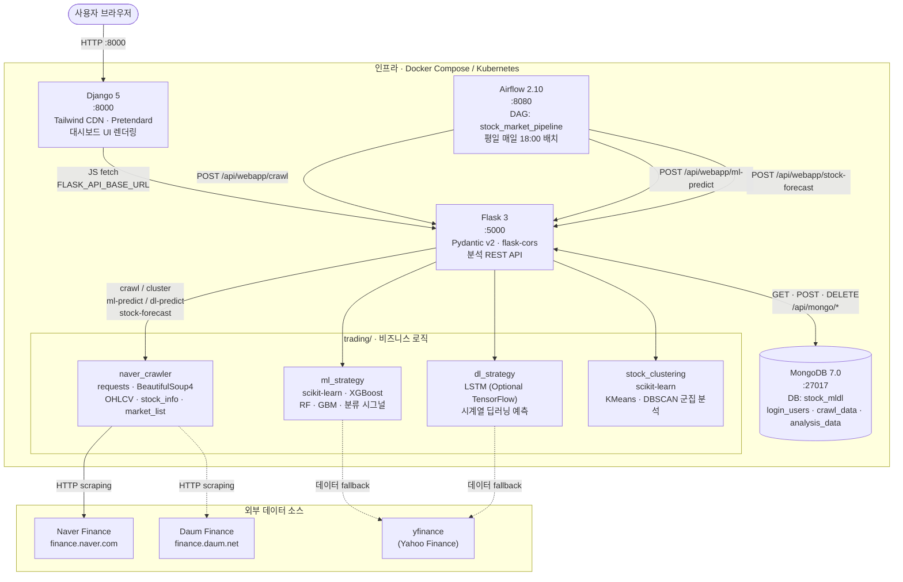
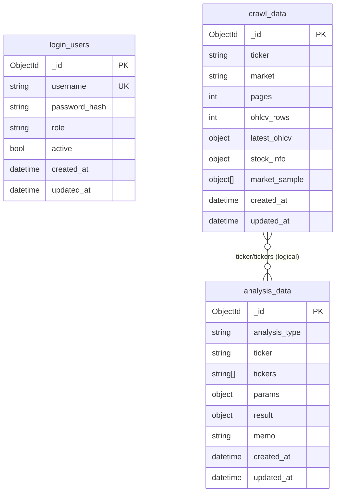

<link rel="stylesheet" href="https://cdnjs.cloudflare.com/ajax/libs/font-awesome/6.5.2/css/all.min.css" />

# Stock ML/DL Trading Workstation

국내 주식 크롤링, 군집화, ML/DL 예측, MongoDB 기록, Airflow 배치를 하나의 워크스테이션으로 재구성한 프로젝트입니다.

---

## <i class="fa-solid fa-clipboard-list"></i> 프로젝트 시작 전 체크리스트

> 이 프로젝트를 원활하게 진행하기 위해 아래 항목을 사전에 확인하세요.

---

### 1. <i class="fa-solid fa-brain"></i> 개인별 습득해야 할 기술 스택

#### 필수 (Must-have)

| 분야 | 기술 / 도구 | 권장 학습 수준 |
|---|---|---|
| **언어** | Python 3.10+ | 함수·클래스·예외 처리, 가상환경(venv) 운용 가능 수준 |
| **웹 프레임워크** | Django 5, Flask 3 | 라우팅·템플릿·REST API 기본 구현 가능 수준 |
| **데이터 분석** | pandas, numpy | DataFrame 조작, 시계열 인덱싱, 결측치 처리 가능 수준 |
| **머신러닝** | scikit-learn, XGBoost | RandomForest·GBM 모델 학습·평가, 파이프라인 구성 가능 수준 |
| **웹 스크래핑** | requests, BeautifulSoup4 | HTML 파싱, 테이블 추출, User-Agent 설정 가능 수준 |
| **데이터베이스** | MongoDB | 컬렉션·도큐먼트 CRUD, pymongo 인덱싱 기본 이해 |
| **컨테이너** | Docker, Docker Compose | 이미지 빌드·컨테이너 실행·볼륨·네트워크 기본 이해 |
| **버전 관리** | Git / GitHub | 브랜치 전략, PR·리뷰 기본 워크플로우 이해 |

#### 권장 (Nice-to-have)

| 분야 | 기술 / 도구 | 권장 학습 수준 |
|---|---|---|
| **딥러닝** | TensorFlow 2 / Keras | LSTM 시계열 모델 구성·학습 기본 이해 (선택적 DL 기능 사용 시) |
| **배치 오케스트레이션** | Apache Airflow 2 | DAG 개념 이해, 태스크 의존성 설정 가능 수준 |
| **쿠버네티스** | Kubernetes (k8s) | Deployment·Service·Ingress 기본 리소스 적용 가능 수준 (클라우드 배포 시) |
| **주식·금융 도메인** | OHLCV, 기술적 분석 기초 | 일봉 데이터 구조, 이동평균·RSI 등 지표 기본 개념 이해 |
| **API 설계** | REST API, Pydantic v2 | 요청/응답 스키마 검증, HTTP 상태 코드 이해 |

---

### 2. <i class="fa-solid fa-laptop"></i> 권장 PC 사양

모든 서비스(Django · Flask · MongoDB · Airflow)를 **로컬에서 동시 실행**하는 기준입니다.

| 항목 | 최소 사양 | 권장 사양 |
|---|---|---|
| **OS** | Windows 10/11 (WSL2), macOS 12+, Ubuntu 20.04+ | macOS 14+ / Ubuntu 22.04+ |
| **CPU** | 4코어 (Intel i5 / AMD Ryzen 5 이상) | 8코어 이상 (Apple M-series 포함) |
| **RAM** | 8 GB | **16 GB 이상** ← Airflow 단독 4 GB 점유 |
| **스토리지** | SSD 20 GB 여유 공간 | SSD 50 GB 이상 (Docker 이미지·MongoDB 데이터 고려) |
| **GPU** | 불필요 (CPU 전용 ML 가능) | NVIDIA CUDA 지원 GPU (TensorFlow LSTM 학습 가속 시) |
| **인터넷** | Naver Finance / Yahoo Finance 접근 가능 환경 | 방화벽·프록시 없는 일반 가정용 인터넷 |
| **Docker** | Docker Desktop 4.x 이상 | Docker Desktop 최신 버전 |

> <i class="fa-solid fa-triangle-exclamation"></i>️ **Apple Silicon(M1/M2/M3/M4) 주의**: TensorFlow 사용 시 `tensorflow-macos` + `tensorflow-metal` 패키지로 대체 설치가 필요합니다.  
> <i class="fa-solid fa-triangle-exclamation"></i>️ **Windows 사용자**: Docker Desktop 실행을 위해 WSL2(Windows Subsystem for Linux 2) 활성화가 필수입니다.

---

### 3. <i class="fa-solid fa-globe"></i> 가입해야 할 플랫폼

| 플랫폼 | 목적 | 가입 필요 여부 | 비용 |
|---|---|---|---|
| **GitHub** | 소스 코드 클론·협업·PR | <i class="fa-solid fa-circle-check"></i> 필수 | 무료 |
| **Docker Hub** | 공식 이미지(mongo:7.0, airflow:2.10) 풀 | <i class="fa-solid fa-circle-check"></i> 필수 (익명 풀 제한 해소 목적) | 무료 |
| **Naver Finance** | 주가 크롤링 대상 사이트 (로그인 불필요) | <i class="fa-solid fa-circle-xmark"></i> 불필요 | 무료 |
| **Yahoo Finance (yfinance)** | ML·DL 데이터 폴백 소스 (로그인 불필요) | <i class="fa-solid fa-circle-xmark"></i> 불필요 | 무료 |
| **AWS / GCP / Azure** | Kubernetes 클러스터 배포 시 (선택) | <i class="fa-solid fa-diamond" style="color:#f97316;"></i> 선택 | 유료 (하단 비용표 참고) |

---

### 4. <i class="fa-solid fa-coins"></i> 예상 비용 (카드 청구 예상 금액)

#### 로컬 개발 환경 (Docker Compose 기준)

| 항목 | 비용 |
|---|---|
| Python, Docker Desktop, MongoDB Community | **무료** |
| Naver Finance 크롤링, yfinance | **무료** |
| GitHub (개인 공개/비공개 저장소) | **무료** |
| **로컬 개발 합계** | **₩0 / 월** |

> 단, 전기료·인터넷 요금 등 인프라 고정비는 별도입니다.

#### 클라우드 배포 환경 (Kubernetes, 선택 사항)

아래는 **최소 구성(노드 1~2개)** 기준 월 예상 청구 금액입니다.

| 클라우드 | 구성 예시 | 예상 월 비용 (USD) | 원화 환산 (₩1,380/USD 기준) |
|---|---|---|---|
| **AWS EKS** | t3.medium × 2 노드 + EBS 30 GB | ~$100~150/월 | **약 ₩138,000~207,000/월** |
| **GCP GKE** | e2-standard-2 × 2 노드 + Persistent Disk 30 GB | ~$90~130/월 | **약 ₩124,000~179,000/월** |
| **Azure AKS** | Standard_B2s × 2 노드 + Managed Disk 30 GB | ~$80~120/월 | **약 ₩110,000~166,000/월** |
| **국내 NCP(네이버 클라우드)** | Standard-2 × 2 노드 + Block Storage 30 GB | ~₩80,000~130,000/월 | **약 ₩80,000~130,000/월** |

> <i class="fa-solid fa-triangle-exclamation"></i>️ 위 금액은 **참고용 추정치**이며, 실제 사용량·리전·할인·스팟 인스턴스 여부에 따라 달라집니다.  
> <i class="fa-solid fa-triangle-exclamation"></i>️ **클라우드 무료 티어 활용**: AWS Free Tier(12개월), GCP $300 크레딧, Azure $200 크레딧을 통해 초기 테스트 시 비용을 크게 절감할 수 있습니다.  
> <i class="fa-solid fa-triangle-exclamation"></i>️ TensorFlow GPU 학습이 필요한 경우 GPU 인스턴스(p3.xlarge 등) 비용이 **추가로 $1~3/시간** 발생합니다.

---

현재 메인 아키텍처는 아래처럼 나뉩니다.

- `Django`: 메인 웹앱, 템플릿 렌더링, TradingView 톤의 대시보드 UI
- `Flask`: 분석 API 및 Mongo CRUD API
- `Airflow`: 일일 크롤링/예측 배치 오케스트레이션
- `MongoDB`: 사용자, 크롤링, 분석 결과 저장소

기존 `api/` 아래 FastAPI 코드는 분석 로직과 라우트 구현 재사용을 위한 레거시 호환 레이어로 남겨두었습니다.

## 아키텍처 및 기술 스택



| 레이어 | 기술 | 역할 |
|---|---|---|
| 웹 프론트엔드 | Django 5, Tailwind CDN, Pretendard | 대시보드 UI, 템플릿 렌더링 |
| 분석 API | Flask 3, Pydantic v2, flask-cors | 크롤링·ML·DL·군집 REST API |
| 비즈니스 로직 | requests, BeautifulSoup4, scikit-learn, XGBoost, (TensorFlow) | 크롤러·ML·DL·군집 코어 |
| 데이터 저장소 | MongoDB 7.0, SQLite | 사용자·크롤링·분석 결과 영속화 |
| 배치 오케스트레이션 | Airflow 2.10 (SequentialExecutor) | 평일 일일 크롤링·예측 파이프라인 |
| 인프라 | Docker Compose, Kubernetes (k8s/) | 컨테이너 배포·서비스 구성 |
| 외부 데이터 | Naver Finance, Daum Finance, yfinance | 국내 주가·종목 정보 수집 |

## Run

### 1. Local Python Run

```bash
python -m venv .venv
source .venv/bin/activate
pip install -r requirements.txt
```

웹앱 실행:

```bash
python manage.py runserver 0.0.0.0:8000
```

Flask API 실행:

```bash
flask --app flask_api.app run --host 0.0.0.0 --port 5000 --debug
```

브라우저 접속:

- Django Web: `http://127.0.0.1:8000`
- Flask API Health: `http://127.0.0.1:5000/health`

### 2. Docker Compose

```bash
docker compose up --build
```

기본 포트:

- Django Web: `http://localhost:8000`
- Flask API: `http://localhost:5000`
- Airflow UI: `http://localhost:8080`
- MongoDB: `mongodb://localhost:27017`

Airflow 기본 계정은 로컬 개발 기준으로 `admin / admin` 입니다.

## Frontend

메인 대시보드는 Django 템플릿으로 렌더링됩니다.

- 경로: `django_app/dashboard/templates/dashboard/index.html`
- 스타일: Tailwind CDN + Pretendard
- 톤앤매너: TradingView 스타일 다크 워크스테이션

구성 요소:

- 좌측 입력/실행 패널
- 중앙 분석 카드/차트 패널
- 우측 메모/로그
- Mongo CRUD 콘솔
- Django / Flask / Mongo 상태 배지

## API

Flask API 엔드포인트:

- `GET /health`
- `POST /api/webapp/crawl`
- `POST /api/webapp/cluster`
- `POST /api/webapp/ml-predict`
- `POST /api/webapp/dl-predict`
- `POST /api/webapp/stock-forecast`

---

## 크롤러 엔진은 https://github.com/edumgt/python-crawling-lab 의 크롤러 방식을 도입합니다.
## 백엔드 엔진은 https://github.com/edumgt/python-ml-class 의 repo 를 참고하여 py 를 추가합니다.

### 크롤링 데이터 실체 (실행 검증 기반)

아래는 **2026-05-14 UTC 기준으로 실제 실행한 결과**입니다.

- 실행 1: `trading.naver_crawler` 직접 호출
  - `NaverFinanceCrawler().get_daily_ohlcv("005930", pages=2)`
  - `NaverFinanceCrawler().get_stock_info("005930")`
  - `get_market_stocks("kospi", pages=1)`
- 실행 2: Flask API 호출
  - `POST /api/webapp/crawl` with `{"ticker":"005930","market":"kospi","pages":2}`

실행 환경에서 `finance.naver.com` DNS 해석이 불가해(네트워크 제한) 아래처럼 반환되었습니다.

```json
{
  "ticker": "005930",
  "pages": 2,
  "ohlcv_rows": 0,
  "ohlcv_columns": ["Date", "Open", "High", "Low", "Close", "Volume"],
  "ohlcv_dtypes": {
    "Date": "object",
    "Open": "object",
    "High": "object",
    "Low": "object",
    "Close": "object",
    "Volume": "object"
  },
  "date_min": null,
  "date_max": null,
  "latest_ohlcv": null,
  "stock_info": {
    "ticker": "005930",
    "error": "HTTPSConnectionPool(... Failed to resolve 'finance.naver.com' ...)"
  },
  "market_rows": 0,
  "market_columns": ["Name", "Ticker", "Price", "Market"],
  "market_head3": []
}
```

Flask API 레벨에서는 동일 조건에서 다음 응답을 확인했습니다.

```json
{
  "status": 404,
  "body": {
    "detail": "데이터 없음: 005930"
  }
}
```

즉, 이 프로젝트의 크롤링 데이터 실체는 다음과 같습니다.

1. **OHLCV 기본 스키마는 고정**: `Date, Open, High, Low, Close, Volume`
2. **정상 수집 시** `Date`는 datetime, 가격/거래량은 float으로 반환됨
3. **수집 실패 시(네트워크/DNS 등)** 빈 DataFrame 스키마를 유지하고 행 수(`ohlcv_rows`)는 0
4. 웹 API(`/api/webapp/crawl`)는 OHLCV가 비면 404(`데이터 없음`)를 반환
5. `stock_info`는 실패 시 `error` 필드가 포함될 수 있음

`/api/webapp/crawl` 성공 시 응답 payload 필드는 아래 구조를 사용합니다.

- `ticker`: 요청 종목코드
- `ohlcv_rows`: 수집된 일봉 행 수
- `latest_ohlcv`: 최신 1건 (`Date, Open, High, Low, Close, Volume`)
- `stock_info`: 종목 메타 정보 (`name, price, change, rate, fetched_at`)
- `market`: 요청 시장(`KOSPI`/`KOSDAQ`)
- `market_sample`: 시장 샘플 종목 배열(최대 10건)
- `mongo_id`: Mongo 저장 성공 시에만 포함

Mongo CRUD:

- `GET /api/mongo/health`
- `POST /api/mongo/users`
- `POST /api/mongo/auth/login`
- `GET /api/mongo/users`
- `GET /api/mongo/crawls`
- `GET /api/mongo/analyses`
- `DELETE /api/mongo/users/<id>`
- `DELETE /api/mongo/crawls/<id>`
- `DELETE /api/mongo/analyses/<id>`

### MongoDB Schema (BE Process)



## Airflow

Airflow DAG 위치:

- `airflow/dags/trading_pipeline.py`

현재 DAG는 다음 흐름을 가집니다.

1. 시세 크롤링
2. ML 시그널 실행
3. 일일 예측 리포트 실행

이 배치는 Flask API를 호출하는 방식으로 구성되어 있어, 웹 실행 경로와 배치 실행 경로가 동일한 비즈니스 로직을 공유합니다.

## Structure

```text
django_app/
  dashboard/
  trading_web/

flask_api/
  app.py

airflow/
  dags/
    trading_pipeline.py

api/
  routers/
  mongodb_store.py

trading/
  naver_crawler.py
  stock_clustering.py
  ml_strategy.py
  dl_strategy.py
  webapp_analytics.py
```


## Notes

- MongoDB는 현재 웹앱 전체의 필수 의존성은 아닙니다.
- Mongo가 내려가 있어도 Flask 분석 API는 가능한 범위에서 결과를 반환하고, 저장만 건너뜁니다.
- Airflow는 공식 `apache/airflow` 이미지를 사용하며 로컬 개발용 `standalone` 모드로 실행됩니다.
- ML·DL·Forecast 기능은 `yfinance` 소스 선택 시 Yahoo Finance 경로로 정상 동작합니다. Naver Finance 크롤링은 해당 도메인 접근이 가능한 환경에서만 수집됩니다.


--- 

### docker 포트 사용 시 주의

Found the root cause. Port 8761 is in Windows' excluded port range (8702–8801) — Windows reserves it and WSL2 can't forward it, hence the 500 error.
