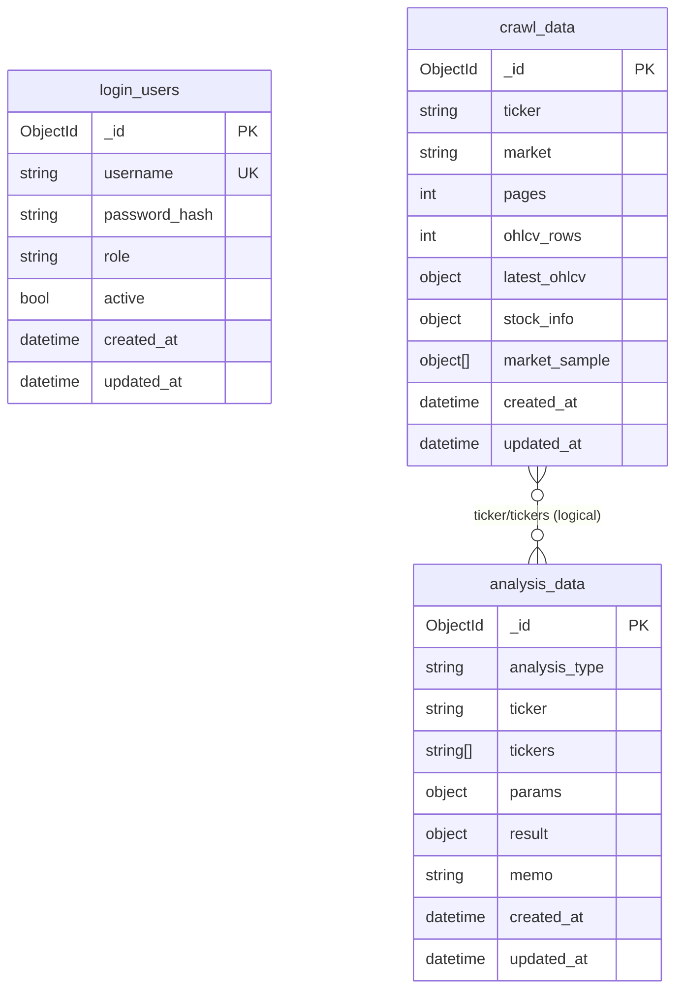

<link rel="stylesheet" href="https://cdnjs.cloudflare.com/ajax/libs/font-awesome/6.5.2/css/all.min.css" />
 
# Stock ML/DL Trading Workstation

국내 주식 크롤링, 군집화, ML/DL 예측, MongoDB 기록, Airflow 배치를 하나의 워크스테이션으로 재구성한 프로젝트입니다.

---

# 🗺️ 길 찾기 비유로 이해하는 딥러닝 (노드와 가중치)

딥러닝이 최적의 정답을 찾아가는 과정은 복잡하게 얽힌 길(네트워크)에서 가장 빠르고 정확한 **지름길(최적의 경로)을 개척하는 과정**과 매우 흡사합니다.

---

## 📍 길 찾기 비유로 보는 딥러닝 핵심 개념

| 딥러닝 개념 | 길 찾기 비유 | 역할 설명 |
| :--- | :--- | :--- |
| **노드 (Node / 인공뉴런)** | **교차로 / 환승역** | 정보가 모이고 다음 길로 갈라지는 변곡점입니다. 앞길에서 온 자극들을 모아 다음 목적지로 보낼지 말지 결정합니다. |
| **가중치 (Weight)** | **도로의 상태 (포장도로 vs 진흙길)** | 특정 교차로와 교차로 사이를 잇는 **길의 퀄리티(중요도)**입니다. 지름길이나 아스팔트 길은 가중치가 높고, 막히는 길이나 자갈길은 가중치가 낮아집니다. |
| **편향 (Bias)** | **기본적인 이동 성향** | 묻지도 따지지도 않고 특정 방향으로 가려는 내비게이션의 기본 성향이나 기본 속도입니다. |
| **학습 (Training)** | **시행착오를 통한 내비게이션 업데이트** | 처음에는 길을 몰라 헤매다가(오차 발생), 여러 번 다녀보면서 "아, 이 길(가중치)이 제일 빠르네!" 하고 알아내는 과정입니다. |

---

## 🔄 딥러닝이 지름길을 찾아가는 3단계 과정

### 1. 출발 (순전파 - Forward Propagation)
처음에는 내비게이션(인공지능)도 초행길이라 어떤 길이 좋은지 모릅니다. 그래서 무작위로 아무 교차로(노드)나 찍고, 아무 길(가중치)이나 골라서 목적지까지 가봅니다. 당연히 처음엔 엄청 지각하거나 길을 헤매게 됩니다.

### 2. 도착 후 반성 (손실 함수 - Loss Function)
목적지에 도착한 뒤, *"예상 시간보다 1시간이나 늦었네!"* 하고 얼마나 헤맸는지 **오차(틀린 정도)**를 계산합니다.

### 3. 길 수정하기 (역전파 - Backpropagation)
다시 출발지로 거슬러 올라가면서 도로 표지판을 고칩니다. 
* *"아까 그 자갈길은 다신 가지 말자 (가중치 낮추기)"*
* *"이 터널로 지나가니까 엄청 빠르네 (가중치 높이기)"*

> 💡 **결론**
> 이 과정을 수백만 번 반복하다 보면, 딥러닝 네트워크 안에 **최적의 가중치 조합(가장 빠른 초고속 고속도로 네트워크)**이 완성됩니다. 즉, 최적의 지름길 지도를 그리는 것이 딥러닝의 본질입니다.

---

## 🧩 이 저장소에서 노드·가중치가 실제로 구현된 코드

위 비유가 이 프로젝트 안에서 어떻게 "실제 코드"로 나타나는지 두 곳에서 확인할 수 있습니다.

### 1) [`trading/dl_strategy.py`](trading/dl_strategy.py) — Keras `Sequential` 모델 (교차로를 쌓아 만든 고속도로망)

`LSTMStrategy._build_model()`이 만드는 신경망 하나하나의 층(layer)이 곧 "교차로 묶음"이고, 층과 층 사이를 잇는 가중치 행렬이 "도로"입니다.

```python
model = keras.Sequential([
    keras.layers.Input(shape=(self.seq_len, n_features)),   # 출발점: 20일치 x 20개 지표 = 입력 교차로 묶음
    keras.layers.LSTM(64, return_sequences=True),           # 64개 노드짜리 1차 교차로 지대
    keras.layers.Dropout(0.2),                               # 일부 길을 무작위로 폐쇄 → 특정 지름길에만 의존하지 않도록(과적합 방지)
    keras.layers.LSTM(32),                                   # 32개 노드짜리 2차 교차로 지대(더 압축된 경로 요약)
    keras.layers.Dropout(0.2),
    keras.layers.Dense(16, activation="relu"),               # 16개 교차로, 목적지 근처 국도
    keras.layers.Dense(3, activation="softmax"),              # 최종 3갈래 길: SELL / HOLD / BUY
])
```

| 비유 | 코드 대응 |
| :--- | :--- |
| 교차로(노드) | `LSTM(64)`, `LSTM(32)`, `Dense(16)` 각 층의 유닛(unit) 개수 |
| 도로(가중치) | 각 층 내부에 자동 생성되는 `kernel`/`recurrent_kernel` 행렬 (Keras가 랜덤 초기화 후 학습으로 값을 갱신) |
| 기본 이동 성향(편향) | 각 층의 `bias` 벡터 |
| 순전파 | `model.predict(...)` — 학습된 가중치로 입력→출력까지 한 번에 흘려보내 SELL/HOLD/BUY 확률을 계산 |
| 손실 함수 | `loss="sparse_categorical_crossentropy"` — 예측 확률과 실제 라벨(하락/보합/상승) 사이의 오차 |
| 역전파 + 길 수정 | `model.fit()` 내부에서 `keras.optimizers.Adam(learning_rate=1e-3)`이 오차를 거슬러 올라가며 각 가중치를 갱신 |
| 시행착오 반복 횟수 | `epochs=30` — 출발~반성~수정을 최대 30번 반복 |
| "더 헤매도 소용없으면 그만 찾기" | `keras.callbacks.EarlyStopping(patience=5, restore_best_weights=True)` — 검증 손실이 5번 연속 개선되지 않으면 조기 종료하고, 가장 성능이 좋았던 가중치로 복원 |

TensorFlow가 없는 환경에서는 `MLPStrategy`(`sklearn.neural_network.MLPClassifier`, `hidden_layer_sizes=(128, 64, 32)`)가 동일한 역할을 하는 폴백으로 동작합니다. 이때도 128→64→32개의 노드를 가진 은닉층 3개가 순서대로 쌓여 같은 구조의 "교차로망"을 형성합니다.

### 2) [`trading/webapp_analytics.py`](trading/webapp_analytics.py) — 넘파이로 직접 짠 Self-Attention (가중치를 눈으로 확인 가능한 코드)

`MultiHeadAttention` 클래스는 Keras처럼 가중치를 숨기지 않고, 도로(가중치) 행렬을 코드에서 그대로 변수로 노출합니다.

```python
@dataclass
class MultiHeadAttention:
    def __post_init__(self) -> None:
        rng = np.random.default_rng(self.seed)
        head_dim = self.d_model // self.n_heads
        self.wq = rng.normal(0, 0.05, (self.n_heads, self.d_model, head_dim))  # "질문"용 도로
        self.wk = rng.normal(0, 0.05, (self.n_heads, self.d_model, head_dim))  # "비교 기준"용 도로
        self.wv = rng.normal(0, 0.05, (self.n_heads, self.d_model, head_dim))  # "실제 정보"를 나르는 도로
        self.wo = rng.normal(0, 0.05, (self.d_model, self.d_model))            # 도착 후 정리하는 도로

    def forward(self, x: np.ndarray) -> tuple[np.ndarray, list[np.ndarray]]:
        for h in range(self.n_heads):
            q = x @ self.wq[h]
            k = x @ self.wk[h]
            v = x @ self.wv[h]
            weights = _softmax((q @ k.T) / np.sqrt(head_dim))   # 어느 과거 시점(교차로)이 더 중요한지 확률로 환산
            ...
```

| 비유 | 코드 대응 |
| :--- | :--- |
| 교차로(노드) | 시계열의 각 시점(최근 N거래일)이 하나의 노드 역할 |
| 도로(가중치) | `wq`, `wk`, `wv`, `wo` — 명시적인 넘파이 행렬. 값이 클수록 그 경로(시점 간 관계)의 중요도가 높다는 뜻 |
| 도로의 혼잡도 계산 | `_softmax((q @ k.T) / np.sqrt(head_dim))` — 모든 시점 쌍의 "연결 강도"를 확률(합=1)로 정규화한 것이 바로 어텐션 가중치 |
| 순전파 | `forward()` 메서드 — 이 저장소 안에서 유일하게 "forward"라는 이름을 그대로 가진 함수 |

`trading/dl_strategy.py`가 학습(가중치를 갱신하는) 쪽을 담당한다면, 이 파일의 어텐션 함수들(`_self_attention_1d`, `_transformer_encode`, `MultiHeadAttention`)은 **고정된 가중치로 순전파만 수행해 "어느 과거 날짜가 오늘 예측에 가장 큰 영향을 주는 도로였는지"를 시각화**하는 교육용 코드입니다. Flask API의 학습 콘텐츠(`attention_report`, `sequence_lstm` 관련 리포트)에서 이 결과를 그대로 프론트엔드 차트로 내려줍니다.

---

## <i class="fa-solid fa-clipboard-list"></i> 프로젝트 시작 전 체크리스트

> 이 프로젝트를 원활하게 진행하기 위해 아래 항목을 사전에 확인하세요.

---

### 1. <i class="fa-solid fa-brain"></i> 개인별 습득해야 할 기술 스택

#### 필수 (Must-have)

| 분야 | 기술 / 도구 | 권장 학습 수준 |
|---|---|---|
| **언어** | Python 3.10+ | 함수·클래스·예외 처리, 가상환경(venv) 운용 가능 수준 |
| **웹 프레임워크** | Django 5, Flask 3 | 라우팅·템플릿·REST API 기본 구현 가능 수준 |
| **데이터 분석** | pandas, numpy | DataFrame 조작, 시계열 인덱싱, 결측치 처리 가능 수준 |
| **머신러닝** | scikit-learn, XGBoost | RandomForest·GBM 모델 학습·평가, 파이프라인 구성 가능 수준 |
| **웹 스크래핑** | requests, BeautifulSoup4 | HTML 파싱, 테이블 추출, User-Agent 설정 가능 수준 |
| **데이터베이스** | MongoDB | 컬렉션·도큐먼트 CRUD, pymongo 인덱싱 기본 이해 |
| **컨테이너** | Docker, Docker Compose | 이미지 빌드·컨테이너 실행·볼륨·네트워크 기본 이해 |
| **버전 관리** | Git / GitHub | 브랜치 전략, PR·리뷰 기본 워크플로우 이해 |

#### 권장 (Nice-to-have)

| 분야 | 기술 / 도구 | 권장 학습 수준 |
|---|---|---|
| **딥러닝** | TensorFlow 2 / Keras | LSTM 시계열 모델 구성·학습 기본 이해 (선택적 DL 기능 사용 시) |
| **배치 오케스트레이션** | Apache Airflow 2 | DAG 개념 이해, 태스크 의존성 설정 가능 수준 |
| **쿠버네티스** | Kubernetes (k8s) | Deployment·Service·Ingress 기본 리소스 적용 가능 수준 (클라우드 배포 시) |
| **주식·금융 도메인** | OHLCV, 기술적 분석 기초 | 일봉 데이터 구조, 이동평균·RSI 등 지표 기본 개념 이해 |
| **API 설계** | REST API, Pydantic v2 | 요청/응답 스키마 검증, HTTP 상태 코드 이해 |

---

### 2. <i class="fa-solid fa-laptop"></i> 권장 PC 사양

모든 서비스(Django · Flask · MongoDB · Airflow)를 **로컬에서 동시 실행**하는 기준입니다.

| 항목 | 최소 사양 | 권장 사양 |
|---|---|---|
| **OS** | Windows 10/11 (WSL2), macOS 12+, Ubuntu 20.04+ | macOS 14+ / Ubuntu 22.04+ |
| **CPU** | 4코어 (Intel i5 / AMD Ryzen 5 이상) | 8코어 이상 (Apple M-series 포함) |
| **RAM** | 8 GB | **16 GB 이상** ← Airflow 단독 4 GB 점유 |
| **스토리지** | SSD 20 GB 여유 공간 | SSD 50 GB 이상 (Docker 이미지·MongoDB 데이터 고려) |
| **GPU** | 불필요 (CPU 전용 ML 가능) | NVIDIA CUDA 지원 GPU (TensorFlow LSTM 학습 가속 시) |
| **인터넷** | Naver Finance / Yahoo Finance 접근 가능 환경 | 방화벽·프록시 없는 일반 가정용 인터넷 |
| **Docker** | Docker Desktop 4.x 이상 | Docker Desktop 최신 버전 |

> <i class="fa-solid fa-triangle-exclamation"></i>️ **Apple Silicon(M1/M2/M3/M4) 주의**: TensorFlow 사용 시 `tensorflow-macos` + `tensorflow-metal` 패키지로 대체 설치가 필요합니다.  
> <i class="fa-solid fa-triangle-exclamation"></i>️ **Windows 사용자**: Docker Desktop 실행을 위해 WSL2(Windows Subsystem for Linux 2) 활성화가 필수입니다.

---

### 3. <i class="fa-solid fa-globe"></i> 가입해야 할 플랫폼

| 플랫폼 | 목적 | 가입 필요 여부 | 비용 |
|---|---|---|---|
| **GitHub** | 소스 코드 클론·협업·PR | <i class="fa-solid fa-circle-check"></i> 필수 | 무료 |
| **Docker Hub** | 공식 이미지(mongo:7.0, airflow:2.10) 풀 | <i class="fa-solid fa-circle-check"></i> 필수 (익명 풀 제한 해소 목적) | 무료 |
| **Naver Finance** | 주가 크롤링 대상 사이트 (로그인 불필요) | <i class="fa-solid fa-circle-xmark"></i> 불필요 | 무료 |
| **Yahoo Finance (yfinance)** | ML·DL 데이터 폴백 소스 (로그인 불필요) | <i class="fa-solid fa-circle-xmark"></i> 불필요 | 무료 |
| **AWS / GCP / Azure** | Kubernetes 클러스터 배포 시 (선택) | <i class="fa-solid fa-diamond" style="color:#f97316;"></i> 선택 | 유료 (하단 비용표 참고) |

---

### 4. <i class="fa-solid fa-coins"></i> 예상 비용 (카드 청구 예상 금액)

#### 로컬 개발 환경 (Docker Compose 기준)

| 항목 | 비용 |
|---|---|
| Python, Docker Desktop, MongoDB Community | **무료** |
| Naver Finance 크롤링, yfinance | **무료** |
| GitHub (개인 공개/비공개 저장소) | **무료** |
| **로컬 개발 합계** | **₩0 / 월** |

> 단, 전기료·인터넷 요금 등 인프라 고정비는 별도입니다.

#### 클라우드 배포 환경 (Kubernetes, 선택 사항)

아래는 **최소 구성(노드 1~2개)** 기준 월 예상 청구 금액입니다.

| 클라우드 | 구성 예시 | 예상 월 비용 (USD) | 원화 환산 (₩1,380/USD 기준) |
|---|---|---|---|
| **AWS EKS** | t3.medium × 2 노드 + EBS 30 GB | ~$100~150/월 | **약 ₩138,000~207,000/월** |
| **GCP GKE** | e2-standard-2 × 2 노드 + Persistent Disk 30 GB | ~$90~130/월 | **약 ₩124,000~179,000/월** |
| **Azure AKS** | Standard_B2s × 2 노드 + Managed Disk 30 GB | ~$80~120/월 | **약 ₩110,000~166,000/월** |
| **국내 NCP(네이버 클라우드)** | Standard-2 × 2 노드 + Block Storage 30 GB | ~₩80,000~130,000/월 | **약 ₩80,000~130,000/월** |

> <i class="fa-solid fa-triangle-exclamation"></i>️ 위 금액은 **참고용 추정치**이며, 실제 사용량·리전·할인·스팟 인스턴스 여부에 따라 달라집니다.  
> <i class="fa-solid fa-triangle-exclamation"></i>️ **클라우드 무료 티어 활용**: AWS Free Tier(12개월), GCP $300 크레딧, Azure $200 크레딧을 통해 초기 테스트 시 비용을 크게 절감할 수 있습니다.  
> <i class="fa-solid fa-triangle-exclamation"></i>️ TensorFlow GPU 학습이 필요한 경우 GPU 인스턴스(p3.xlarge 등) 비용이 **추가로 $1~3/시간** 발생합니다.

---

현재 메인 아키텍처는 아래처럼 나뉩니다.

- `Django`: 메인 웹앱, 템플릿 렌더링, TradingView 톤의 대시보드 UI
- `Flask`: 분석 API 및 Mongo CRUD API
- `Airflow`: 일일 크롤링/예측 배치 오케스트레이션
- `MongoDB`: 사용자, 크롤링, 분석 결과 저장소

기존 `api/` 아래 FastAPI 코드는 분석 로직과 라우트 구현 재사용을 위한 레거시 호환 레이어로 남겨두었습니다.

## 아키텍처 및 기술 스택


| 레이어 | 기술 | 역할 |
|---|---|---|
| 웹 프론트엔드 | Django 5, Tailwind CDN, Pretendard | 대시보드 UI, 템플릿 렌더링 |
| 분석 API | Flask 3, Pydantic v2, flask-cors | 크롤링·ML·DL·군집 REST API |
| 비즈니스 로직 | requests, BeautifulSoup4, scikit-learn, XGBoost, (TensorFlow) | 크롤러·ML·DL·군집 코어 |
| 데이터 저장소 | MongoDB 7.0, SQLite | 사용자·크롤링·분석 결과 영속화 |
| 배치 오케스트레이션 | Airflow 2.10 (SequentialExecutor) | 평일 일일 크롤링·예측 파이프라인 |
| 인프라 | Docker Compose, Kubernetes (k8s/) | 컨테이너 배포·서비스 구성 |
| 외부 데이터 | Naver Finance, Daum Finance, yfinance | 국내 주가·종목 정보 수집 |

## Run

### 1. Local Python Run

```bash
python -m venv .venv
source .venv/bin/activate
pip install -r requirements.txt
```

웹앱 실행:

```bash
python manage.py runserver 0.0.0.0:8000
```

Flask API 실행:

```bash
flask --app flask_api.app run --host 0.0.0.0 --port 5000 --debug
```

브라우저 접속:

- Django Web: `http://127.0.0.1:8000`
- Flask API Health: `http://127.0.0.1:5000/health`

### 2. Docker Compose

```bash
docker compose up --build
```

기본 포트:

- Django Web: `http://localhost:8000`
- Flask API: `http://localhost:5000`
- Airflow UI: `http://localhost:8080`
- MongoDB: `mongodb://localhost:27017`

Airflow 기본 계정은 로컬 개발 기준으로 `admin / admin` 입니다.

## Frontend

메인 대시보드는 Django 템플릿으로 렌더링됩니다.

- 경로: `django_app/dashboard/templates/dashboard/index.html`
- 스타일: Tailwind CDN + Pretendard
- 톤앤매너: TradingView 스타일 다크 워크스테이션

구성 요소:

- 좌측 입력/실행 패널
- 중앙 분석 카드/차트 패널
- 우측 메모/로그
- Mongo CRUD 콘솔
- Django / Flask / Mongo 상태 배지

## API

Flask API 엔드포인트:

- `GET /health`
- `POST /api/webapp/crawl`
- `POST /api/webapp/cluster`
- `POST /api/webapp/ml-predict`
- `POST /api/webapp/dl-predict`
- `POST /api/webapp/stock-forecast`

## GCP Vertex AI MLOps 확장

현재 `/api/webapp/ml-predict`, `/dl-predict`는 요청 안에서 로컬 모델을 학습하는 실험용 경로입니다. 운영 환경에서는 학습과 예측을 분리해 **Cloud Storage → Vertex AI CustomJob → Model Registry → Endpoint → Flask Backend API** 흐름을 권장합니다.

- 상세 설계·권한·피처 계약·CustomJob·Model Registry alias·Canary/롤백·Flask API 계약: [Vertex AI 운영 가이드](docs/vertex-ai-workflow.md)
- 운영 예측 API 권장 경로: `POST /api/webapp/vertex-predict` (구현 시 Flask가 Vertex Endpoint를 서버 측에서 호출)
- 기존 로컬/Docker와 Vertex AI의 기술·비용·보안·확장성 비교는 위 가이드의 **로컬 PC와 Vertex AI 비교** 표를 참고하세요.

## AWS SageMaker AI MLOps 확장

기존 Canvas 빠른 시작 외에, 코드 기반의 운영 워크플로우는 **S3 → SageMaker Training → Model Registry(Model Package Group) → Real-time Endpoint → Flask Backend API**로 구성합니다.

- 상세 설계·S3 데이터 계약·Training Job·Model Registry approval·Canary/rollback·Flask API 계약: [SageMaker AI 운영 가이드](docs/sagemaker-workflow.md)
- 운영 예측 API 권장 경로: `POST /api/webapp/sagemaker-predict` (구현 시 Flask가 IAM role로 SageMaker Endpoint를 서버 측에서 호출)
- Canvas를 이용한 no-code 빠른 시작은 [기존 SageMaker Canvas 가이드](sagemaker/README.md)를 참고하세요.

### 이 저장소에 권장하는 AWS AI 리소스

이 프로젝트는 시세 시계열의 `BUY` / `SELL` / `HOLD` 분류 모델을 학습·제공하는 워크로드입니다. 따라서 생성형 AI용 **Amazon Bedrock**보다, 사용자 정의 scikit-learn/XGBoost/LSTM 학습과 모델 서빙을 제공하는 **Amazon SageMaker AI**가 핵심 서비스입니다. Bedrock은 향후 분석 결과를 자연어로 요약하는 기능을 추가할 때만 선택적으로 사용합니다.

| 목적 | AWS 리소스 | 이 저장소의 연결 지점 | 운영 시점 |
|---|---|---|---|
| 원천·정제 데이터와 모델 artifact 보관 | Amazon S3 | OHLCV, `FeatureBuilder` 결과, train/validation 분할, `model.tar.gz` | 필수 |
| 재현 가능한 ML/DL 학습 | SageMaker AI Training Job | `trading/ml_strategy.py`, `trading/dl_strategy.py`의 피처·학습 코드를 학습 컨테이너로 분리 | 필수 |
| 실험 비교 | SageMaker Experiments | 데이터 버전, Git SHA, macro F1, 하이퍼파라미터 기록 | 권장 |
| 모델 버전·승인 관리 | SageMaker Model Registry | `PendingManualApproval → Approved → Deprecated` 모델 승격 | 필수 |
| 실시간 예측 | SageMaker AI real-time endpoint | Flask가 서버 측에서 `InvokeEndpoint` 호출 | 실시간 화면/API 필요 시 |
| 대량 일괄 예측 | SageMaker Batch Transform | 장 마감 후 전체 종목 신호 생성 | 일일 배치에 권장 |
| 학습/서빙 컨테이너 보관 | Amazon ECR | 웹앱 Docker 이미지와 분리한 trainer/serving 이미지 | 커스텀 코드 운영 시 |
| 로그·지표·알림 | Amazon CloudWatch + S3 Data Capture | endpoint 지연·오류·호출량, 추론 요청/응답 보관 | 권장 |
| 권한 | IAM role | SageMaker 실행 역할, Flask/ECS/EKS 실행 역할 | 필수 |
| 스케줄 연결 | Airflow 또는 EventBridge Scheduler | 현재 Airflow DAG에서 학습/Batch Transform 시작 | 선택 |

브라우저가 AWS를 직접 호출하지 않도록 합니다. Django/Flask 컨테이너에 연결한 IAM role만 특정 endpoint의 `sagemaker:InvokeEndpoint` 권한을 갖게 하고, Flask가 입력 검증·피처 생성·결과 기록을 담당합니다. 액세스 키를 이미지, Git, `.env`에 저장하지 마세요.

### AWS CLI 빠른 시작 — 코드 기반 MLOps

아래 명령은 서울 리전(`ap-northeast-2`) 예시입니다. 실행 전 AWS CLI v2와 AWS IAM Identity Center(SSO) 또는 임시 자격증명을 설정하고, `aws sts get-caller-identity`가 성공하는지 확인하세요. 실제 생성·과금이 발생하는 명령이므로 개발 계정에서 먼저 실행합니다.

```bash
# 0) 공통 변수와 자격증명 확인
export AWS_REGION=ap-northeast-2
export AWS_ACCOUNT_ID="$(aws sts get-caller-identity --query Account --output text)"
export BUCKET="stock-ml-${AWS_ACCOUNT_ID}-${AWS_REGION}"
export SAGEMAKER_EXEC_ROLE_ARN="arn:aws:iam::${AWS_ACCOUNT_ID}:role/SageMakerStockExecutionRole"

aws sts get-caller-identity
aws s3api create-bucket \
  --bucket "$BUCKET" \
  --region "$AWS_REGION" \
  --create-bucket-configuration "LocationConstraint=$AWS_REGION"
aws s3api put-public-access-block --bucket "$BUCKET" \
  --public-access-block-configuration \
  'BlockPublicAcls=true,IgnorePublicAcls=true,BlockPublicPolicy=true,RestrictPublicBuckets=true'
aws s3api put-bucket-versioning --bucket "$BUCKET" \
  --versioning-configuration Status=Enabled
aws s3api put-bucket-encryption --bucket "$BUCKET" \
  --server-side-encryption-configuration \
  '{"Rules":[{"ApplyServerSideEncryptionByDefault":{"SSEAlgorithm":"AES256"}}]}'
```

`SageMakerStockExecutionRole`에는 최소한 curated 데이터의 `s3:GetObject`, artifact prefix의 `s3:PutObject`, ECR image pull, CloudWatch Logs 권한을 부여합니다. API 컨테이너의 런타임 role은 production endpoint ARN에 한정한 `sagemaker:InvokeEndpoint`만 부여합니다. 첫 실행 전에는 조직의 IAM 관리자와 bucket/ECR ARN 범위를 확정하세요.

아래의 `data/train.parquet`, `data/validation.parquet`, trainer/serving Dockerfile은 아직 이 저장소에서 운영용으로 분리해야 하는 예시 경로입니다. 먼저 [SageMaker AI 운영 가이드](docs/sagemaker-workflow.md)의 피처 계약을 따라 `FeatureBuilder.feature_columns`, schema hash, metric, Git SHA를 `metadata.json`에 기록하는 trainer를 준비한 뒤 실행하세요.

```bash
# 1) 이 저장소에서 만든 학습/검증 파일을 날짜 버전으로 업로드
#    (학습 파일은 시간 순서로 split하고, 피처 목록·순서를 metadata에 함께 고정)
export DATASET_VERSION=20260730
aws s3 cp data/train.parquet \
  "s3://${BUCKET}/curated/dataset_version=${DATASET_VERSION}/train.parquet"
aws s3 cp data/validation.parquet \
  "s3://${BUCKET}/curated/dataset_version=${DATASET_VERSION}/validation.parquet"

# 2) trainer/serving 전용 ECR 저장소 생성 (이미 있으면 오류를 무시)
aws ecr create-repository --repository-name stock-ml-trainer --region "$AWS_REGION" || true
aws ecr create-repository --repository-name stock-ml-serving --region "$AWS_REGION" || true

# 3) 커스텀 training image를 전제로 Training Job 제출
#    image는 /opt/ml/input/data/{train,validation}를 읽고 /opt/ml/model에
#    model.joblib와 metadata.json을 기록해야 합니다.
export TRAINING_JOB_NAME="stock-direction-${DATASET_VERSION}-$(date +%H%M%S)"
export TRAINING_IMAGE="${AWS_ACCOUNT_ID}.dkr.ecr.${AWS_REGION}.amazonaws.com/stock-ml-trainer:latest"
aws sagemaker create-training-job \
  --training-job-name "$TRAINING_JOB_NAME" \
  --role-arn "$SAGEMAKER_EXEC_ROLE_ARN" \
  --algorithm-specification "TrainingImage=$TRAINING_IMAGE,TrainingInputMode=File" \
  --input-data-config "[\
    {\"ChannelName\":\"train\",\"DataSource\":{\"S3DataSource\":{\"S3DataType\":\"S3Prefix\",\"S3Uri\":\"s3://${BUCKET}/curated/dataset_version=${DATASET_VERSION}/train.parquet\",\"S3DataDistributionType\":\"FullyReplicated\"}}},\
    {\"ChannelName\":\"validation\",\"DataSource\":{\"S3DataSource\":{\"S3DataType\":\"S3Prefix\",\"S3Uri\":\"s3://${BUCKET}/curated/dataset_version=${DATASET_VERSION}/validation.parquet\",\"S3DataDistributionType\":\"FullyReplicated\"}}}\
  ]" \
  --output-data-config "S3OutputPath=s3://${BUCKET}/training/output" \
  --resource-config "InstanceType=ml.m5.xlarge,InstanceCount=1,VolumeSizeInGB=30" \
  --stopping-condition MaxRuntimeInSeconds=3600
aws sagemaker wait training-job-completed-or-stopped --training-job-name "$TRAINING_JOB_NAME"
aws sagemaker describe-training-job --training-job-name "$TRAINING_JOB_NAME" \
  --query '{Status:TrainingJobStatus,Artifact:ModelArtifacts.S3ModelArtifacts}' --output table
```

```bash
# 4) 모델 그룹 생성 후 학습 artifact를 후보 모델로 등록
export MODEL_GROUP=stock-direction-classifier
export MODEL_DATA_URL="$(aws sagemaker describe-training-job --training-job-name "$TRAINING_JOB_NAME" \
  --query ModelArtifacts.S3ModelArtifacts --output text)"
export SERVING_IMAGE="${AWS_ACCOUNT_ID}.dkr.ecr.${AWS_REGION}.amazonaws.com/stock-ml-serving:latest"

aws sagemaker create-model-package-group \
  --model-package-group-name "$MODEL_GROUP" \
  --model-package-group-description 'Korean stock BUY/SELL/HOLD classifier' || true
aws sagemaker create-model-package \
  --model-package-group-name "$MODEL_GROUP" \
  --model-approval-status PendingManualApproval \
  --inference-specification "{\"Containers\":[{\"Image\":\"${SERVING_IMAGE}\",\"ModelDataUrl\":\"${MODEL_DATA_URL}\"}],\"SupportedContentTypes\":[\"application/json\"],\"SupportedResponseMIMETypes\":[\"application/json\"]}"

# 검증을 통과한 package ARN만 Approved로 승격합니다.
aws sagemaker list-model-packages --model-package-group-name "$MODEL_GROUP" \
  --sort-by CreationTime --sort-order Descending --max-results 5
```

배포는 staging endpoint에서 계약 테스트를 한 뒤 production으로 승격합니다. `model.joblib`/`metadata.json`을 읽어 `{"instances":[...]}`를 처리하는 serving image를 사용한다는 전제의 최소 CLI 예시는 다음과 같습니다.

```bash
# 5) 승인된 artifact를 staging real-time endpoint로 배포
export MODEL_NAME=stock-direction-staging-model
export ENDPOINT_CONFIG=stock-direction-staging-config
export ENDPOINT_NAME=stock-direction-staging

aws sagemaker create-model --model-name "$MODEL_NAME" \
  --execution-role-arn "$SAGEMAKER_EXEC_ROLE_ARN" \
  --primary-container "Image=$SERVING_IMAGE,ModelDataUrl=$MODEL_DATA_URL"
aws sagemaker create-endpoint-config --endpoint-config-name "$ENDPOINT_CONFIG" \
  --production-variants "VariantName=blue,ModelName=$MODEL_NAME,InitialInstanceCount=1,InstanceType=ml.m5.large,InitialVariantWeight=1"
aws sagemaker create-endpoint --endpoint-name "$ENDPOINT_NAME" \
  --endpoint-config-name "$ENDPOINT_CONFIG"
aws sagemaker wait endpoint-in-service --endpoint-name "$ENDPOINT_NAME"

# 6) CLI 추론 호출: JSON 파일에는 metadata.json과 동일한 피처 이름·순서를 사용
printf '%s' '{"instances":[{"Returns":0.01,"MA5_Ratio":1.0}]}' > /tmp/stock-request.json
aws sagemaker-runtime invoke-endpoint --endpoint-name "$ENDPOINT_NAME" \
  --content-type application/json --accept application/json \
  --body fileb:///tmp/stock-request.json /tmp/stock-response.json
cat /tmp/stock-response.json

# 7) 테스트가 끝나면 endpoint부터 삭제하여 시간 과금을 중단
aws sagemaker delete-endpoint --endpoint-name "$ENDPOINT_NAME"
aws sagemaker wait endpoint-deleted --endpoint-name "$ENDPOINT_NAME"
aws sagemaker delete-endpoint-config --endpoint-config-name "$ENDPOINT_CONFIG"
aws sagemaker delete-model --model-name "$MODEL_NAME"
```

실제 production에서는 `create-model`의 artifact/image 대신 **Approved Model Registry package version**을 배포 기준으로 기록하고, 기존/new variant의 traffic weight를 90/10으로 시작해 CloudWatch 오류율·지연시간·사후 성능을 확인합니다. 상시 endpoint는 호출이 없어도 비용이 발생하므로, 장 마감 일괄 신호는 Batch Transform, 실시간 화면만 endpoint를 사용하세요. Canvas가 필요한 분석가용 no-code 경로와 endpoint 정리 스크립트는 아래의 Canvas 섹션을 사용하면 됩니다.

AWS CLI 옵션과 서비스 동작은 [SageMaker AI CLI 명령 참조](https://docs.aws.amazon.com/cli/latest/reference/sagemaker/), [Model Registry 모델 버전 관리](https://docs.aws.amazon.com/sagemaker/latest/dg/model-registry-models.html), [S3 기본 암호화](https://docs.aws.amazon.com/AmazonS3/latest/userguide/default-bucket-encryption.html)를 기준으로 확인하세요. 인스턴스·endpoint·Canvas 가격은 리전과 시점에 따라 달라지므로 배포 직전에 AWS Pricing 페이지에서 재확인합니다.

---

## 크롤러 엔진은 https://github.com/edumgt/python-crawling-lab 의 크롤러 방식을 도입합니다.
## 백엔드 엔진은 https://github.com/edumgt/python-ml-class 의 repo 를 참고하여 py 를 추가합니다.

### 크롤링 데이터 실체 (실행 검증 기반)

아래는 **2026-05-14 UTC 기준으로 실제 실행한 결과**입니다.

- 실행 1: `trading.naver_crawler` 직접 호출
  - `NaverFinanceCrawler().get_daily_ohlcv("005930", pages=2)`
  - `NaverFinanceCrawler().get_stock_info("005930")`
  - `get_market_stocks("kospi", pages=1)`
- 실행 2: Flask API 호출
  - `POST /api/webapp/crawl` with `{"ticker":"005930","market":"kospi","pages":2}`

실행 환경에서 `finance.naver.com` DNS 해석이 불가해(네트워크 제한) 아래처럼 반환되었습니다.

```json
{
  "ticker": "005930",
  "pages": 2,
  "ohlcv_rows": 0,
  "ohlcv_columns": ["Date", "Open", "High", "Low", "Close", "Volume"],
  "ohlcv_dtypes": {
    "Date": "object",
    "Open": "object",
    "High": "object",
    "Low": "object",
    "Close": "object",
    "Volume": "object"
  },
  "date_min": null,
  "date_max": null,
  "latest_ohlcv": null,
  "stock_info": {
    "ticker": "005930",
    "error": "HTTPSConnectionPool(... Failed to resolve 'finance.naver.com' ...)"
  },
  "market_rows": 0,
  "market_columns": ["Name", "Ticker", "Price", "Market"],
  "market_head3": []
}
```

Flask API 레벨에서는 동일 조건에서 다음 응답을 확인했습니다.

```json
{
  "status": 404,
  "body": {
    "detail": "데이터 없음: 005930"
  }
}
```

즉, 이 프로젝트의 크롤링 데이터 실체는 다음과 같습니다.

1. **OHLCV 기본 스키마는 고정**: `Date, Open, High, Low, Close, Volume`
2. **정상 수집 시** `Date`는 datetime, 가격/거래량은 float으로 반환됨
3. **수집 실패 시(네트워크/DNS 등)** 빈 DataFrame 스키마를 유지하고 행 수(`ohlcv_rows`)는 0
4. 웹 API(`/api/webapp/crawl`)는 OHLCV가 비면 404(`데이터 없음`)를 반환
5. `stock_info`는 실패 시 `error` 필드가 포함될 수 있음

`/api/webapp/crawl` 성공 시 응답 payload 필드는 아래 구조를 사용합니다.

- `ticker`: 요청 종목코드
- `ohlcv_rows`: 수집된 일봉 행 수
- `latest_ohlcv`: 최신 1건 (`Date, Open, High, Low, Close, Volume`)
- `stock_info`: 종목 메타 정보 (`name, price, change, rate, fetched_at`)
- `market`: 요청 시장(`KOSPI`/`KOSDAQ`)
- `market_sample`: 시장 샘플 종목 배열(최대 10건)
- `mongo_id`: Mongo 저장 성공 시에만 포함

Mongo CRUD:

- `GET /api/mongo/health`
- `POST /api/mongo/users`
- `POST /api/mongo/auth/login`
- `GET /api/mongo/users`
- `GET /api/mongo/crawls`
- `GET /api/mongo/analyses`
- `DELETE /api/mongo/users/<id>`
- `DELETE /api/mongo/crawls/<id>`
- `DELETE /api/mongo/analyses/<id>`

### MongoDB Schema (BE Process)



## Airflow

Airflow DAG 위치:

- `airflow/dags/trading_pipeline.py`

현재 DAG는 다음 흐름을 가집니다.

1. 시세 크롤링
2. ML 시그널 실행
3. 일일 예측 리포트 실행

이 배치는 Flask API를 호출하는 방식으로 구성되어 있어, 웹 실행 경로와 배치 실행 경로가 동일한 비즈니스 로직을 공유합니다.

## Structure

```text
django_app/
  dashboard/
  trading_web/

flask_api/
  app.py

airflow/
  dags/
    trading_pipeline.py

api/
  routers/
  mongodb_store.py

trading/
  naver_crawler.py
  stock_clustering.py
  ml_strategy.py
  dl_strategy.py
  webapp_analytics.py
```


## Notes

- MongoDB는 현재 웹앱 전체의 필수 의존성은 아닙니다.
- Mongo가 내려가 있어도 Flask 분석 API는 가능한 범위에서 결과를 반환하고, 저장만 건너뜁니다.
- Airflow는 공식 `apache/airflow` 이미지를 사용하며 로컬 개발용 `standalone` 모드로 실행됩니다.
- ML·DL·Forecast 기능은 `yfinance` 소스 선택 시 Yahoo Finance 경로로 정상 동작합니다. Naver Finance 크롤링은 해당 도메인 접근이 가능한 환경에서만 수집됩니다.

---

## <i class="fa-brands fa-aws"></i> AWS SageMaker Canvas 연동

로컬 ML/DL 모델 외에 **AWS SageMaker Canvas** 노코드 AutoML을 연동할 수 있습니다.  
Canvas는 코드 없이 UI에서 모델을 학습하고, 학습된 모델을 AWS 실시간 엔드포인트로 배포해  
Flask API(`/api/webapp/canvas-predict`)에서 호출하는 방식입니다.

### 전체 흐름

```
로컬 크롤링 → 피처 CSV → S3 업로드 → Canvas UI 학습 → SageMaker 엔드포인트 → Flask API
```

### 필요한 AWS 권한

| IAM 정책 | 용도 |
|---|---|
| `AmazonSageMakerFullAccess` | Studio 도메인, Canvas, 엔드포인트 관리 |
| `AmazonS3FullAccess` | 학습 데이터 S3 업로드/다운로드 |
| `AmazonForecastFullAccess` | Canvas 내부 시계열 모델 사용 시 |

### Canvas 학습 데이터 스키마 (21개 피처)

| 컬럼 | 유형 | 설명 |
|---|---|---|
| `Returns` | NUMERIC | 당일 수익률 |
| `MA5_Ratio` ~ `MA60_Ratio` | NUMERIC | 이동평균 비율 (5/20/60일) |
| `MACD`, `MACD_Signal`, `MACD_Hist` | NUMERIC | MACD 지표 |
| `RSI14` | NUMERIC | RSI 14일 (0~100) |
| `Stoch_K`, `Stoch_D` | NUMERIC | 스토캐스틱 |
| `Williams_R` | NUMERIC | Williams %R |
| `BB_Width`, `BB_Position` | NUMERIC | 볼린저 밴드 |
| `ATR14`, `Volatility` | NUMERIC | 변동성 지표 |
| `Volume_Change`, `Volume_MA_Ratio`, `OBV_Change` | NUMERIC | 거래량 지표 |
| `Momentum_5`, `Momentum_20` | NUMERIC | 5일/20일 모멘텀 |
| **`Signal`** | **TEXT** | **타깃: `BUY` / `SELL` / `HOLD`** |

> 상세 스키마: [`sagemaker/data/feature_schema.md`](sagemaker/data/feature_schema.md)

### 단계별 AWS CLI 실행

```bash
# 1. AWS 환경 설정 (IAM 역할, S3 버킷 생성)
bash sagemaker/01_setup_env.sh

# 2. OHLCV 크롤링 → 피처 CSV 생성 → S3 업로드
#    (기본: 삼성전자 005930, 40페이지)
bash sagemaker/02_prepare_data.sh 005930 40

# 3. SageMaker Studio Domain / Canvas 앱 생성 + 접속 URL 출력
bash sagemaker/03_create_domain.sh
#    → 브라우저에서 Canvas UI 열기
#    → Datasets에서 s3://버킷/canvas/train/ 로드
#    → Signal 컬럼을 Target으로 지정 후 Standard build 학습

# 4. Canvas 학습 완료 후 엔드포인트 배포
bash sagemaker/04_deploy_endpoint.sh

# 5. 엔드포인트 호출 테스트
bash sagemaker/05_invoke_endpoint.sh 005930

# 6. Flask API 연동 테스트
python3 sagemaker/06_integrate_flask.py 005930

# 7. 사용 후 리소스 정리 (과금 차단 — 반드시 실행)
bash sagemaker/07_cleanup.sh
```

### Flask API 연동 포인트

`sagemaker/06_integrate_flask.py`의 `FLASK_ROUTE_CODE`를 `flask_api/app.py`에 추가하면  
`POST /api/webapp/canvas-predict` 엔드포인트가 활성화됩니다.

```bash
# 호출 예시
curl -X POST http://localhost:5000/api/webapp/canvas-predict \
     -H "Content-Type: application/json" \
     -d '{"ticker":"005930","pages":5}'

# 응답 예시
{
  "ticker": "005930",
  "signal": "BUY",
  "probabilities": {"BUY": 0.621, "SELL": 0.183, "HOLD": 0.196},
  "model_type": "canvas",
  "endpoint": "alphastation-canvas-endpoint"
}
```

### 예상 비용 (서울 리전, ap-northeast-2)

| 항목 | 단가 | 비고 |
|---|---|---|
| S3 (학습 데이터 ~50MB) | ~$0/월 | 프리 티어 포함 |
| Canvas 세션 | $1.90/시간 | UI 학습 시간만 과금 |
| ml.m5.large 엔드포인트 | $0.134/시간 | 상시 → 월 ~$97 |
| ml.m5.large 엔드포인트 | $0.134/시간 | 필요 시만 (10h) → ~$1.3 |

> ⚠️ **엔드포인트는 사용 후 반드시 `07_cleanup.sh`로 삭제**하세요.  
> 개발 테스트 목적이라면 엔드포인트 상시 운영 대신 **Batch Transform** 또는 **로컬 ML**을 사용하세요.

---

### docker 포트 사용 시 주의

Found the root cause. Port 8761 is in Windows' excluded port range (8702–8801) — Windows reserves it and WSL2 can't forward it, hence the 500 error.
