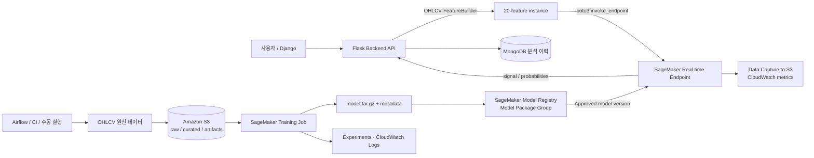

# AWS SageMaker AI 기반 ML/DL 학습·등록·배포·백엔드 API 운영 가이드

이 문서는 이 저장소의 주가 방향성 예측을 AWS에서 운영하기 위한 **S3 데이터 레이크 → SageMaker Training → Model Registry → Real-time Endpoint → Flask API** 워크플로우를 정의합니다. 기존 [`sagemaker/README.md`](../sagemaker/README.md)는 Canvas 중심의 빠른 시작 가이드이고, 이 문서는 코드 기반 학습·승인·배포를 포함한 운영 설계입니다.

> 범위: `trading/ml_strategy.py`의 20개 기술 지표와 `BUY` / `SELL` / `HOLD` 분류 문제를 기준으로 합니다. 예측 신호는 연구·보조 지표이며 투자 판단의 근거가 되어서는 안 됩니다.

## 1. 저장소의 현재 구조와 전환 목적

현재 경로는 `Django → Flask → api/routers/webapp.py → trading/`입니다. `/api/webapp/ml-predict`와 `/dl-predict`는 HTTP 요청 안에서 OHLCV를 수집하고 `train()`과 `predict()`를 연속 실행합니다. 즉, 로컬에서 빠르게 알고리즘을 확인하기에는 좋지만 운영 모델을 제공하는 방식은 아닙니다.

| 현재 로컬 방식 | 운영 문제 | SageMaker 전환 후 |
|---|---|---|
| 요청마다 학습하고 바로 예측 | 긴 응답 시간, 동일 요청도 모델이 달라질 수 있음 | Training Job은 비동기 실행, API는 승인된 모델만 추론 |
| 개발 PC의 `models/`에 의존 | 컨테이너 재시작·다중 replica에서 artifact/버전 불일치 | S3 artifact + Model Package Group의 version으로 추적 |
| CV·accuracy가 응답에만 존재 | 배포된 모델과 metric의 연결이 약함 | model package metadata, tags, approval에 데이터/metric/Git SHA 기록 |
| Flask가 수집·학습·추론을 함께 수행 | CPU/GPU 격리, scaling, rollback이 어려움 | 수집·학습·서빙을 독립 서비스로 운영 |

로컬 `/ml-predict`, `/dl-predict`는 실험용으로 유지하고, 운영 UI/Airflow에는 새 `POST /api/webapp/sagemaker-predict`를 추가하는 방식을 권장합니다. 이 API는 절대로 학습을 수행하지 않습니다.

## 2. 목표 아키텍처



| 계층 | 책임 | 이 저장소와의 연결 |
|---|---|---|
| S3 | raw OHLCV, 시간 분할 데이터, 학습 결과 모델 | `FeatureBuilder`의 입력과 training output |
| SageMaker Training | 고정 컨테이너와 instance에서 학습·평가 | `trading.ml_strategy.FeatureBuilder` 재사용 또는 trainer로 추출 |
| SageMaker Experiments | run 간 파라미터·metric 비교 | accuracy, macro F1, CV, Git SHA 기록 |
| Model Registry | Model Package Group 안의 version과 승인 상태 | `PendingManualApproval → Approved → Deprecated` |
| Endpoint | 승인 모델의 실시간 추론, traffic variant | Flask가 `sagemaker-runtime.invoke_endpoint` 호출 |
| Flask | 인증 은닉, 입력 검증, 피처 생성, 응답 정규화 | 브라우저가 AWS credential을 갖지 않는 BFF |

## 3. 사전 준비, 리전, IAM

예시는 기존 프로젝트의 AWS 기본값과 동일하게 `ap-northeast-2`(서울)를 사용합니다. S3 bucket, ECR 이미지, Training Job, Endpoint를 같은 리전에 둡니다.

```bash
export AWS_REGION='ap-northeast-2'
export AWS_ACCOUNT_ID="$(aws sts get-caller-identity --query Account --output text)"
export BUCKET="stock-ml-${AWS_ACCOUNT_ID}-${AWS_REGION}"
aws s3api create-bucket --bucket "$BUCKET" \
  --create-bucket-configuration LocationConstraint="$AWS_REGION"
aws ecr create-repository --repository-name stock-ml-trainer --region "$AWS_REGION" || true
aws ecr create-repository --repository-name stock-ml-serving --region "$AWS_REGION" || true
```

역할을 사람/CI/런타임별로 분리하고, S3 bucket는 prefix 수준으로 권한을 제한합니다.

| 주체 | 필요한 권한 방향 | 용도 |
|---|---|---|
| Training execution role | SageMaker가 assume, `s3:GetObject`(curated), `s3:PutObject`(artifacts), ECR pull, CloudWatch Logs | Training Job 컨테이너 |
| Flask runtime role | `sagemaker:InvokeEndpoint`를 운영 Endpoint ARN으로 제한, 필요한 raw/curated read | ECS/EKS/EC2/Lambda/컨테이너의 API 호출 |
| CI/CD role | ECR push, Training/Registry/Endpoint 관리, `iam:PassRole`을 지정 execution role로 제한 | 이미지/워크플로우 배포 |
| 사람 역할 | Studio/콘솔에서 조회·승인만 필요한 최소 권한 | 모델 검토·승인 |

`AmazonSageMakerFullAccess`, 관리자 권한, 액세스 키를 Flask 컨테이너에 넣는 방식은 개발 외에는 피합니다. ECS task role, EKS IRSA, EC2 instance profile, Lambda execution role처럼 임시 자격증명을 제공하는 IAM 역할을 사용합니다. 로컬에서만 AWS CLI profile/SSO를 사용합니다.

## 4. 데이터·피처 계약과 시계열 검증

학습 container와 Flask는 `FeatureBuilder.feature_columns`의 같은 20개 피처를 **같은 이름·순서·계산 버전**으로 사용해야 합니다. 원천 OHLCV 계약은 `Date, Open, High, Low, Close, Volume`입니다.

```text
return(t) = Close(t + forward_days) / Close(t) - 1
BUY  : return(t) > threshold
SELL : return(t) < -threshold
HOLD : otherwise
```

- train/validation/test는 시간순으로 분리하고 마지막 `forward_days` 행은 라벨 생성에서 제외합니다.
- 기존 `TimeSeriesSplit(gap=forward_days)`를 유지해 미래 관측치 누수를 차단합니다.
- scaler/imputer는 train에만 `fit`, validation/test/API에는 `transform`만 허용합니다.
- `metadata.json`에 피처 목록·순서·schema hash, `forward_days`, `threshold`, dataset URI/checksum, 기간, Git SHA, metric을 기록합니다.
- Endpoint에는 metadata의 schema hash와 일치하는 feature dict만 보냅니다. 결측/컬럼 불일치를 0으로 조용히 치환하지 않습니다.

권장 S3 prefix:

```text
s3://<bucket>/
  raw/dt=2026-07-24/ticker=005930/ohlcv.parquet
  curated/dataset_version=20260724/manifest.json
  curated/dataset_version=20260724/train.parquet
  curated/dataset_version=20260724/validation.parquet
  training/output/run=20260724-001/model.tar.gz
  registry/metadata/run=20260724-001.json
  monitoring/data-capture/
```

## 5. 코드 기반 Training Job

SageMaker Training은 S3 데이터를 컨테이너에 제공하고 학습 결과를 S3 output으로 저장합니다. `scikit-learn`, `xgboost`, `joblib`, trainer만 포함한 전용 이미지를 ECR에 빌드합니다. 웹앱 이미지를 학습 이미지로 겸용하지 않으면 의존성 고정·취약점 관리·GPU 이미지 분리가 쉬워집니다.

trainer는 `/opt/ml/input/data/train` 및 `/opt/ml/input/data/validation`에서 데이터를 읽고, `/opt/ml/model`에 아래 파일을 기록해야 합니다. SageMaker가 이 디렉터리를 `model.tar.gz`로 패키징하여 S3에 저장합니다.

```text
/opt/ml/model/
  model.joblib
  metadata.json
```

`metadata.json`에는 최소한 `feature_columns`, `schema_hash`, 클래스 label mapping, dataset version, Git SHA, metric을 넣습니다. serving container는 이 파일을 모델과 함께 로드하여 피처를 검증합니다.

SageMaker Python SDK로 job을 시작하는 예시입니다.

```python
from sagemaker.sklearn import SKLearn

role = "arn:aws:iam::<account-id>:role/SageMakerStockTrainingRole"
estimator = SKLearn(
    entry_point="train.py",
    source_dir="sagemaker/trainer",
    role=role,
    instance_type="ml.m5.xlarge",
    instance_count=1,
    framework_version="1.2-1",
    output_path="s3://<bucket>/training/output",
    hyperparameters={"model-type": "rf", "forward-days": 5, "threshold": 0.01},
    tags=[{"Key": "git_sha", "Value": "<sha>"}, {"Key": "dataset_version", "Value": "20260724"}],
)
estimator.fit({
    "train": "s3://<bucket>/curated/dataset_version=20260724/train/",
    "validation": "s3://<bucket>/curated/dataset_version=20260724/validation/",
}, wait=True)
```

운영에서는 Airflow 또는 SageMaker Pipelines를 통해 `데이터 검증 → training → 평가 → model package 등록 → 사람 승인 → staging 배포 → production 승격`으로 나눕니다. training 성공만으로 Endpoint를 자동 교체하지 않습니다.

## 6. Model Registry: 등록, 승인, 계보

SageMaker Model Registry에서 하나의 Model Package Group(예: `stock-direction-classifier`)은 논리 모델이며, 재학습 결과는 자동 증가하는 Model Package version입니다. artifact URI와 inference image를 가진 version을 등록하고, 승인 상태를 배포 gate로 사용합니다.

```python
import boto3

sm = boto3.client("sagemaker", region_name="ap-northeast-2")
group_name = "stock-direction-classifier"
try:
    sm.create_model_package_group(
        ModelPackageGroupName=group_name,
        ModelPackageGroupDescription="Korean stock BUY/SELL/HOLD classifier",
    )
except sm.exceptions.ResourceInUse:
    pass

response = sm.create_model_package(
    ModelPackageGroupName=group_name,
    ModelApprovalStatus="PendingManualApproval",
    InferenceSpecification={
        "Containers": [{
            "Image": "<account>.dkr.ecr.ap-northeast-2.amazonaws.com/stock-ml-serving:<git-sha>",
            "ModelDataUrl": "s3://<bucket>/training/output/<job>/output/model.tar.gz",
        }],
        "SupportedContentTypes": ["application/json"],
        "SupportedResponseMIMETypes": ["application/json"],
    },
    CustomerMetadataProperties={
        "dataset_version": "20260724",
        "schema_hash": "sha256:<hash>",
        "macro_f1": "<value>",
        "git_sha": "<sha>",
    },
)
print(response["ModelPackageArn"])
```

승인 전에는 `PendingManualApproval`, staging 검증 후 `Approved`, 대체된 모델은 `Deprecated`로 관리합니다. promotion 조건 예시는 기존 production 대비 macro F1 저하 없음, 클래스별 recall/백테스트 손실 한도 통과, schema hash 일치, staging smoke test 통과입니다. Registry version에는 정수 version만 존재하므로 Vertex의 mutable alias와 달리, production에 배포할 model package ARN/version을 배포 manifest에 명시적으로 기록합니다.

## 7. Real-time Endpoint, Canary, 롤백

먼저 `stock-direction-staging` Endpoint에 Approved version을 올려 feature contract·응답 형식·권한을 확인합니다. 이후 production Endpoint의 새 production variant에 5~10%의 traffic을 할당합니다.

```python
from sagemaker.model import ModelPackage

package_arn = "arn:aws:sagemaker:ap-northeast-2:<account>:model-package/stock-direction-classifier/7"
staging = ModelPackage(role=role, model_package_arn=package_arn)
predictor = staging.deploy(
    initial_instance_count=1,
    instance_type="ml.m5.large",
    endpoint_name="stock-direction-staging",
)
```

production은 `CreateEndpointConfig`의 `ProductionVariants`에 이전/신규 모델을 함께 선언하고 `InitialVariantWeight`를 각각 `0.9`/`0.1`로 설정합니다. CloudWatch의 invocation error, latency, CPU/memory, Flask의 validation 오류, 예측 class 분포 및 사후 레이블 성능을 보고 신규 variant weight를 올립니다. 장애 시 `UpdateEndpointWeightsAndCapacities`로 신규 variant를 0으로 내리고 구 버전으로 즉시 되돌립니다. model package를 먼저 삭제하면 rollback 계보가 끊기므로 보존 기간 뒤에만 정리합니다.

요청/응답을 S3에 비동기로 남길 Data Capture를 Endpoint Config에 활성화하되, 티커·피처와 결과는 민감한 운영 데이터일 수 있으므로 KMS encryption, lifecycle/retention, bucket access policy를 적용합니다. SageMaker Model Monitor는 신규 고객 접근이 2026-07-30부터 종료될 예정이므로, 새 도입에서는 Data Capture + CloudWatch + 자체 분석/재학습 검증을 기본 계획으로 두고 기존 이용자만 Monitor 지속 사용 여부를 검토합니다.

## 8. Flask Backend API 제공 방식

브라우저에서 SageMaker runtime을 직접 호출하지 않습니다. Flask가 BFF로서 AWS IAM role로 Endpoint를 호출하면 access key·endpoint 세부 정보가 클라이언트에 노출되지 않고, 기존 데이터 수집·피처 생성·Mongo 기록과 동일한 곳에서 처리됩니다.

환경 변수:

```dotenv
AWS_REGION=ap-northeast-2
SAGEMAKER_ENDPOINT_NAME=stock-direction-production
SAGEMAKER_PREDICT_TIMEOUT_SECONDS=10
```

권장 API 계약:

```text
POST /api/webapp/sagemaker-predict
요청:  {"ticker":"005930", "source":"yfinance", "pages":30, "period":"3y"}
성공:  {"ticker":"005930", "signal":"BUY", "probabilities":{...},
         "endpoint":"stock-direction-production", "variant":"blue", "latency_ms":42}
실패:  400(입력/피처 오류), 404(OHLCV 없음), 503(Endpoint 설정/일시 장애), 504(timeout)
```

`api.routers.webapp._load_ohlcv()`와 `FeatureBuilder`로 마지막 피처 행을 만들고 schema를 검증한 뒤, `boto3` runtime client를 process 단위로 재사용합니다.

```python
import json
import os
import boto3

runtime = boto3.client("sagemaker-runtime", region_name=os.getenv("AWS_REGION", "ap-northeast-2"))

def predict_sagemaker(feature_row: dict[str, float]) -> dict:
    response = runtime.invoke_endpoint(
        EndpointName=os.environ["SAGEMAKER_ENDPOINT_NAME"],
        ContentType="application/json",
        Accept="application/json",
        Body=json.dumps({"instances": [feature_row]}).encode("utf-8"),
    )
    return {
        "prediction": json.loads(response["Body"].read()),
        "variant": response.get("InvokedProductionVariant"),
    }
```

serving container는 `/ping` health check와 `/invocations` request handler를 제공하며, `application/json`의 `{"instances": [...]}`를 읽어 `{"predictions": [...]}`로 응답하도록 계약을 고정합니다. AWS의 기본 scikit-learn serving 방식을 쓸 경우 `input_fn`, `predict_fn`, `output_fn`에서 이 계약을 맞춥니다. custom container는 Dockerfile의 `serve` entrypoint에서 같은 계약을 구현합니다.

MongoDB `analysis_data`에는 `analysis_type: "sagemaker_prediction"`, endpoint 이름, `InvokedProductionVariant`, registry model package ARN/version, schema hash, latency, 결과를 남깁니다. 예측 payload·티커를 CloudWatch에 원문 그대로 쓰지 말고 request ID와 필요한 비식별 지표만 기록합니다.

## 9. 로컬 PC, Vertex AI, SageMaker 비교

| 항목 | 로컬 PC / Docker Compose | GCP Vertex AI | AWS SageMaker AI |
|---|---|---|---|
| 학습 실행 | 개발자 PC의 Python/Docker | Vertex CustomJob | SageMaker Training Job |
| 모델 버전 | `models/` 파일 중심 | Model Registry model version + alias | Model Package Group + numerical package version/approval |
| artifact 저장 | 로컬 디스크/볼륨 | Cloud Storage | Amazon S3 (`model.tar.gz`) |
| 온라인 추론 | Flask가 모델을 학습·추론 | Vertex Endpoint `predict` | Real-time Endpoint `invoke_endpoint` |
| 단계 승격 | 수동 배포 규칙 필요 | alias와 deployed model/traffic split | Approval status와 endpoint variant weight |
| 컨테이너 저장소 | Docker local/registry | Artifact Registry | Amazon ECR |
| 인증 | 로컬 환경 변수·개발자 credential | ADC, service account, Workload Identity | IAM role, ECS/EKS/EC2/Lambda temporary credential |
| 관측 | 콘솔 로그·Mongo | Cloud Logging/Monitoring/Experiments | CloudWatch, Experiments, S3 Data Capture |
| 적합한 목적 | 피처 개발·디버깅·소규모 실험 | GCP 중심 운영·관리형 MLOps | AWS 중심 운영·S3/ECR/IAM 통합 |

기능의 우열보다 이미 사용하는 cloud, 네트워크/ID 표준, 비용 약정, 운영 역량에 맞춰 한 플랫폼을 production source of truth로 정하는 것이 중요합니다. Vertex와 SageMaker의 production Endpoint를 동시에 진실의 원천으로 운영하면 피처/버전 drift와 비용이 증가합니다.

## 10. 운영 체크리스트

- [ ] 데이터 version, checksum, split manifest, Git SHA, 패키지/이미지 digest, feature schema hash가 model metadata에 기록된다.
- [ ] Flask와 training/serving의 피처 이름·순서가 동일하다는 계약 테스트가 있다.
- [ ] `PendingManualApproval → Approved → Deprecated` 전환 기준과 승인 책임자가 있다.
- [ ] endpoint role은 `InvokeEndpoint`만 필요 Endpoint ARN으로 제한하며 access key를 이미지·Git·`.env`에 저장하지 않는다.
- [ ] Endpoint variant, model package ARN/version, latency, 오류율, 예측 분포를 Mongo/CloudWatch에서 추적한다.
- [ ] raw/curated/artifact/data-capture bucket에 encryption, lifecycle, least privilege를 적용한다.
- [ ] canary 실패 시 이전 production variant로 weight를 되돌리는 runbook이 있다.
- [ ] 실험 종료 시 training instance, staging endpoint, 불필요한 endpoint를 삭제 또는 scale-down하여 비용을 차단한다.

## 공식 참고 문서

- [SageMaker AI model training](https://docs.aws.amazon.com/sagemaker/latest/dg/train-model.html)
- [SageMaker Model Registry: model groups and versions](https://docs.aws.amazon.com/sagemaker/latest/dg/model-registry-models.html)
- [Register a model version](https://docs.aws.amazon.com/sagemaker/latest/dg/model-registry-version.html)
- [Real-time Endpoint data capture](https://docs.aws.amazon.com/sagemaker/latest/dg/model-monitor-data-capture-endpoint.html)
