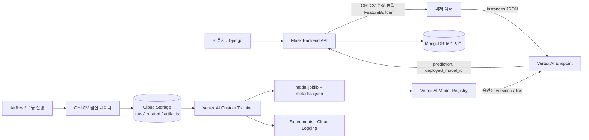

# GCP Vertex AI 기반 ML/DL 학습·배포·백엔드 API 운영 가이드

이 문서는 이 저장소의 주가 방향성 예측을 **로컬 즉시 학습 방식**에서 GCP Vertex AI의 **재현 가능한 학습, Model Registry 버전 관리, Online Endpoint 서빙** 방식으로 확장하는 설계 및 실행 절차를 정의합니다.

> 범위: 현재 `trading/ml_strategy.py`의 20개 기술 지표와 `BUY` / `SELL` / `HOLD` 분류 문제를 기준으로 설명합니다. 투자 신호는 연구·보조 지표이며 실제 투자 판단의 근거가 되어서는 안 됩니다.

## 1. 현재 저장소 분석과 전환 목표

현재 요청 경로는 `Django → Flask → api/routers/webapp.py → trading/`입니다. `POST /api/webapp/ml-predict`와 `/dl-predict`는 요청마다 OHLCV를 수집하고 `MLStrategy.train()` 또는 `DLStrategy.train()`을 실행합니다. 이 방식은 노트북/개발 검증에는 간단하지만, 운영 서빙에는 다음 한계가 있습니다.

| 현재 구현 | 운영상 영향 | Vertex AI 전환 후 |
|---|---|---|
| HTTP 요청에서 학습과 예측을 함께 수행 | 응답 시간이 길고 동일 입력도 실행마다 모델이 달라질 수 있음 | 학습은 비동기 `CustomJob`, API는 등록된 고정 모델만 예측 |
| `models/` 로컬 디렉터리를 모델 기본 위치로 사용 | 컨테이너 재시작·다중 인스턴스에서 모델/메타데이터 일관성을 보장하기 어려움 | GCS 아티팩트 + Model Registry 버전으로 추적 |
| 80/20 시계열 분할·walk-forward CV는 코드에 존재 | 성능 수치와 실제 배포 모델의 연결이 없음 | metric, 데이터 URI, Git SHA, 스키마 hash를 모델 버전에 기록 |
| Flask 프로세스가 데이터 수집·학습·추론을 모두 담당 | CPU/GPU 자원 격리와 스케일링이 어려움 | 수집/피처/학습/서빙을 독립적으로 확장 |

전환 후에도 기존 `/ml-predict`와 `/dl-predict`는 **로컬 실험용**으로 유지할 수 있습니다. 운영 UI와 Airflow는 새 `/api/webapp/vertex-predict`를 호출하게 하며, 이 API는 학습하지 않습니다.

## 2. 목표 아키텍처



데이터와 모델의 역할을 분리합니다.

| 계층 | 책임 | 이 저장소와의 연결 |
|---|---|---|
| Cloud Storage | 원천 OHLCV, 학습/검증 split manifest, 모델 아티팩트 | `FeatureBuilder` 입력 및 `AIP_MODEL_DIR` 출력 |
| Vertex AI CustomJob | 컨테이너에서 재현 가능한 학습·평가 | `trading.ml_strategy.FeatureBuilder`를 재사용하거나 별도 trainer로 추출 |
| Vertex AI Experiments | run별 파라미터·metric 비교 | `accuracy`, `cv_mean`, 클래스별 F1, Git SHA 기록 |
| Model Registry | 승인된 모델 버전의 계보·alias | `candidate`, `staging`, `production` alias 운영 |
| Endpoint | 등록 모델의 online prediction | Flask가 `aiplatform.Endpoint.predict()`로 호출 |
| Flask | 인증, 입력 검증, 피처 생성, 응답 정규화 | 외부 브라우저에 GCP 자격증명을 노출하지 않는 BFF 역할 |

## 3. 사전 준비와 권한

예시는 리전을 `asia-northeast3`(서울)로 두었습니다. Vertex AI, Artifact Registry, Cloud Storage 리전은 가능한 한 동일 위치로 맞춰 데이터 이동 지연과 비용을 줄입니다. 해당 리전의 원하는 머신/GPU 가용성은 배포 직전에 콘솔에서 확인합니다.

```bash
export PROJECT_ID='YOUR_PROJECT_ID'
export REGION='asia-northeast3'
export BUCKET="${PROJECT_ID}-stock-ml"
gcloud config set project "$PROJECT_ID"
gcloud services enable aiplatform.googleapis.com artifactregistry.googleapis.com storage.googleapis.com
gcloud storage buckets create "gs://${BUCKET}" --location="$REGION" --uniform-bucket-level-access
gcloud artifacts repositories create stock-ml \
  --repository-format=docker --location="$REGION" || true
```

서비스 계정은 사람 계정이나 JSON 키를 공유하지 않고 워크로드별로 분리합니다.

| 주체 | 최소 역할의 방향 | 사용 위치 |
|---|---|---|
| 학습 실행 계정 `vertex-trainer` | Vertex AI 사용자, 학습 버킷의 object read/write | CustomJob 실행 계정 |
| Flask/Cloud Run 계정 `stock-api` | Endpoint에 범위를 제한한 `roles/aiplatform.user`(또는 `aiplatform.endpoints.predict`만 담은 custom role), 필요한 버킷 object viewer | online prediction 호출 |
| CI 계정 | Artifact Registry writer, CustomJob/Model/Endpoint 관리 권한 | 이미지 빌드·배포 자동화 |

프로젝트 전체에 광범위한 Owner 권한을 주지 말고, 버킷은 prefix(`raw/`, `curated/`, `artifacts/`) 단위 권한을 적용합니다. 로컬 개발은 사용자 ADC를 사용합니다.

```bash
gcloud auth application-default login
```

프로덕션 Flask가 Cloud Run/GKE에 있다면 JSON 키 파일 대신 해당 런타임 서비스 계정을 연결합니다. online prediction에는 Endpoint의 `aiplatform.endpoints.predict` 권한이 필요합니다.

## 4. 데이터 계약과 누수 방지

학습과 Flask 예측은 **같은 피처 계약**을 지켜야 합니다. 현재 계약은 `FeatureBuilder.feature_columns`의 20개 컬럼이며, 순서까지 모델 계약입니다. 입력 OHLCV는 `Date, Open, High, Low, Close, Volume`을 사용합니다.

라벨은 기준일 `t`의 종가와 `t + forward_days` 수익률로 생성합니다.

```text
return(t) = Close(t + forward_days) / Close(t) - 1
BUY  : return(t) > threshold
SELL : return(t) < -threshold
HOLD : 그 외
```

필수 통제 사항은 다음과 같습니다.

- train/validation/test를 시간순으로 분할하고, 마지막 `forward_days` 행은 라벨 생성에서 제외합니다.
- walk-forward CV의 `gap=forward_days`를 유지해 train의 미래 라벨이 검증 구간 가격을 참조하지 않게 합니다.
- scaler/imputer가 추가되면 train split에만 `fit`하고 validation/test/API에는 `transform`만 합니다.
- `schema.json`에 피처명·순서, `forward_days`, `threshold`, 학습 기간, 데이터 checksum, Git SHA를 저장합니다. API는 이 스키마와 다른 피처를 Endpoint로 보내지 않습니다.
- 종목·시장·거래정지·수정주가 정책과 타임존(KST)을 raw 데이터 manifest에 명시합니다.

권장 GCS 구조는 아래와 같습니다.

```text
gs://<bucket>/
  raw/dt=2026-07-24/ticker=005930/ohlcv.parquet
  curated/dataset_version=20260724/manifest.json
  curated/dataset_version=20260724/train.parquet
  curated/dataset_version=20260724/validation.parquet
  artifacts/run=<run-id>/model.joblib
  artifacts/run=<run-id>/metadata.json
```

## 5. 학습 컨테이너와 CustomJob

학습 이미지는 저장소의 전체 웹 컨테이너와 분리합니다. `scikit-learn`, `xgboost`, `joblib`, `google-cloud-storage` 및 trainer만 포함시키면 이미지가 작아지고 의존성이 고정됩니다. TensorFlow LSTM 학습은 CPU/GPU 별 이미지를 두고 GPU worker pool에서만 실행합니다.

trainer의 핵심 규칙은 다음입니다.

1. `--train-uri`, `--validation-uri`, `--model-dir`를 인자로 받아 GCS 데이터만 읽습니다.
2. 학습 완료 후 `joblib.dump()`한 모델과 피처 계약/metric을 `AIP_MODEL_DIR`에 저장합니다. Vertex가 이 경로의 결과를 GCS에 보존합니다.
3. 모델 선택은 validation 결과로만 하고, test 점수는 최종 승인용으로 한 번만 사용합니다.
4. 로그에는 `accuracy`, `macro_f1`, `cv_mean`, 클래스 분포, 데이터 버전을 출력하고 민감한 자격증명을 출력하지 않습니다.

CustomJob 제출 예시는 다음과 같습니다. 실행 환경에는 `google-cloud-aiplatform` 패키지가 필요합니다.

```python
from google.cloud import aiplatform

PROJECT_ID = "YOUR_PROJECT_ID"
REGION = "asia-northeast3"
IMAGE_URI = f"{REGION}-docker.pkg.dev/{PROJECT_ID}/stock-ml/trainer:git-sha"
DATASET_URI = f"gs://{PROJECT_ID}-stock-ml/curated/dataset_version=20260724"
ARTIFACT_URI = f"gs://{PROJECT_ID}-stock-ml/artifacts/run=20260724-001"

aiplatform.init(project=PROJECT_ID, location=REGION, staging_bucket=f"gs://{PROJECT_ID}-stock-ml")
job = aiplatform.CustomJob.from_local_script(
    display_name="stock-direction-rf-20260724-001",
    script_path="vertex_ai/trainer/train.py",
    container_uri=IMAGE_URI,
    requirements=["scikit-learn==1.4.*", "joblib>=1.3", "pandas>=2.1", "google-cloud-storage"],
    args=["--dataset-uri", DATASET_URI, "--model-dir", ARTIFACT_URI, "--model-type", "rf"],
    replica_count=1,
    machine_type="n1-standard-4",
)
job.run(
    service_account=f"vertex-trainer@{PROJECT_ID}.iam.gserviceaccount.com",
    sync=True,
)
```

운영에서는 위 제출 코드를 Airflow 태스크 또는 Vertex AI Pipeline 컴포넌트로 감싸고, 데이터 검증 → 학습 → 평가 → 등록 → 승인 → 배포를 단계별로 분리합니다. 학습 job이 성공했다고 자동 production 배포하지 않습니다.

## 6. Model Registry 등록과 승격

학습 결과의 `model.joblib`만 올리는 것보다 serving container가 읽을 `model/` 디렉터리 전체를 아티팩트로 등록합니다. 모델 리소스는 예를 들어 `stock-direction-classifier` 하나로 고정하고, 재학습 결과는 그 모델의 version으로 추가합니다.

```python
from google.cloud import aiplatform

aiplatform.init(project=PROJECT_ID, location=REGION)
model = aiplatform.Model.upload(
    display_name="stock-direction-classifier",
    artifact_uri=ARTIFACT_URI,
    serving_container_image_uri=(
        f"{REGION}-docker.pkg.dev/{PROJECT_ID}/stock-ml/serving:git-sha"
    ),
    serving_container_predict_route="/predict",
    serving_container_health_route="/health",
    serving_container_ports=[8080],
    labels={"task": "stock-direction", "dataset_version": "20260724"},
    version_aliases=["candidate"],
    version_description="dataset=20260724; git_sha=<sha>; macro_f1=<value>",
)
print(model.resource_name)
```

승인 기준의 예시는 `macro_f1`이 현재 production보다 하락하지 않고, 최근 기간 holdout 성능·클래스별 재현율·백테스트 손실 한도를 통과하며, schema hash가 예상값과 일치하는 것입니다. 통과한 version에 `staging` alias를 붙여 smoke test하고, 배포·모니터링 검증 뒤 `production` alias를 이동합니다. alias는 가변 참조이므로 API 설정에 숫자 version ID를 하드코딩하는 것보다 롤백에 유리합니다.

> Registry alias를 바꿔도 이미 Endpoint에 배포된 `DeployedModel`이 자동으로 교체되는 것은 아닙니다. 승격 후에는 명시적으로 새 version을 Endpoint에 배포하고 traffic split을 변경해야 합니다.

## 7. Endpoint 배포, Canary, 롤백

초기에는 별도 `stock-direction-staging` Endpoint에서 smoke test를 마친 후, production Endpoint에 새 모델을 5~10%로 canary 배포합니다. 예측 응답의 `deployed_model_id`, model version, latency를 Flask 로그와 Mongo 분석 이력에 저장합니다.

```python
endpoint = aiplatform.Endpoint.create(display_name="stock-direction-production")
endpoint.deploy(
    model=model,
    deployed_model_display_name="stock-direction-20260724-001",
    machine_type="n1-standard-2",
    min_replica_count=1,
    max_replica_count=3,
    traffic_percentage=10,
    sync=True,
)
```

기존 모델이 90%, 새 모델이 10%가 되도록 하려면 `Endpoint.update(traffic_split=...)` 또는 콘솔에서 deployed model ID별 traffic split을 설정합니다. 새 모델의 오류율, p95 latency, 예측 분포, 사후 실제 라벨 성능을 관찰한 후 100%로 올립니다. 문제 발생 시 새 deployed model의 traffic을 `0`으로 낮추고 직전 version으로 되돌린 뒤 원인을 분석합니다. Endpoint/배포 모델 삭제는 rollback 기간이 지난 뒤에만 수행합니다.

custom serving container는 Vertex가 호출할 `/health`와 `/predict`를 제공해야 합니다. `/predict`는 다음처럼 Vertex 표준 요청을 받아야 합니다.

```json
{"instances": [{"Returns": 0.01, "MA5_Ratio": 1.02, "...": 0.0}]}
```

응답은 다음처럼 예측값과 확률을 반환하도록 고정합니다.

```json
{"predictions": [{"signal": "BUY", "probabilities": {"SELL": 0.12, "HOLD": 0.25, "BUY": 0.63}}]}
```

여러 모델을 한 Endpoint에 올릴 경우 custom container가 동일한 입력/출력 계약을 지켜야 하며, Flask는 traffic split 대상 모델을 직접 선택하지 않습니다.

## 8. Flask Backend API 제공 방식

브라우저가 Vertex Endpoint를 직접 호출하지 않고 Flask가 BFF(Backend for Frontend)로 호출합니다. 이 방식은 Google 인증 토큰과 Endpoint ID를 클라이언트에 노출하지 않고, 티커 검증·OHLCV 수집·FeatureBuilder 실행·timeout/retry·응답 정규화를 한 곳에서 통제합니다.

환경 변수 예시:

```dotenv
GCP_PROJECT_ID=YOUR_PROJECT_ID
GCP_REGION=asia-northeast3
VERTEX_ENDPOINT_ID=1234567890123456789
VERTEX_PREDICT_TIMEOUT_SECONDS=10
```

`requirements.txt`에는 운영 의존성을 선택적으로 추가합니다.

```text
# GCP Vertex AI online prediction (production backend)
google-cloud-aiplatform>=1.70.0
```

권장 Flask 라우트의 동작 계약은 다음과 같습니다.

```text
POST /api/webapp/vertex-predict
요청:  {"ticker":"005930", "source":"yfinance", "pages":30, "period":"3y"}
성공:  {"ticker":"005930", "signal":"BUY", "probabilities":{...},
         "endpoint_id":"...", "deployed_model_id":"...", "latency_ms":42}
실패:  400(입력/피처 오류), 404(OHLCV 없음), 503(Vertex 미설정/일시 장애), 504(timeout)
```

라우트 구현의 핵심은 다음과 같습니다. 실제 코드에서는 기존 `api.routers.webapp._load_ohlcv()`와 `FeatureBuilder`를 재사용하고, `FEATURE_COLUMNS` 순서 검증을 통과한 딕셔너리만 전송합니다.

```python
from google.cloud import aiplatform

def predict_vertex(feature_row: dict[str, float]) -> dict:
    endpoint_id = os.environ["VERTEX_ENDPOINT_ID"]
    aiplatform.init(
        project=os.environ["GCP_PROJECT_ID"],
        location=os.environ.get("GCP_REGION", "asia-northeast3"),
    )
    response = aiplatform.Endpoint(endpoint_id).predict(instances=[feature_row])
    return {
        "prediction": response.predictions[0],
        "deployed_model_id": response.deployed_model_id,
    }
```

API 프로세스 시작 시 `Endpoint` client를 한 번 생성해 재사용하고, 요청마다 `aiplatform.init()`하지 않도록 구현합니다. 네트워크 오류는 무제한 재시도하지 말고 짧은 exponential backoff를 1~2회만 적용합니다. `429`는 특히 즉시 반복 재시도보다 요청 억제와 autoscaling 검토가 적절합니다. 데이터 제공자 오류나 feature schema 불일치는 재시도 대상이 아닙니다.

예측 후 MongoDB `analysis_data`에는 기존 결과에 아래 필드를 추가하는 것을 권장합니다.

```json
{
  "analysis_type": "vertex_prediction",
  "ticker": "005930",
  "model": {
    "endpoint_id": "123...",
    "deployed_model_id": "456...",
    "registry_model": "stock-direction-classifier",
    "version": "20260724-001"
  },
  "feature_schema_hash": "sha256:...",
  "latency_ms": 42,
  "result": {"signal": "BUY", "probabilities": {"BUY": 0.63}}
}
```

이 저장소가 GKE에 배포된 경우에는 `k8s/ml-service` 또는 Flask deployment의 Kubernetes ServiceAccount에 Workload Identity를 연결합니다. Cloud Run으로 Flask를 옮기는 경우에는 Cloud Run 서비스 계정에 Endpoint 범위의 `roles/aiplatform.user` 또는 예측 전용 custom role을 부여합니다. 두 경우 모두 서비스 계정 키를 이미지·Git·`.env`에 저장하지 않습니다.

## 9. 로컬 PC와 Vertex AI 비교

| 항목 | 로컬 PC / Docker Compose | GCP Vertex AI |
|---|---|---|
| 실행 단위 | 개발자 PC의 Python 프로세스·컨테이너 | 관리형 CustomJob·관리형 Endpoint |
| 학습 시작 | API 요청 또는 수동 명령 | Airflow/CI/Pipeline이 데이터 버전으로 비동기 제출 |
| 재현성 | 라이브러리·CPU·로컬 데이터 상태에 좌우 | 고정 이미지 digest, GCS manifest, run metadata |
| 모델 보관 | `models/` 및 개발자 파일시스템 | GCS artifact + Registry version/alias/labels |
| API 지연 | 학습 포함 시 초~분 단위 | 학습 분리 후 online prediction은 모델 로드된 Endpoint로 처리 |
| 확장 | PC CPU/RAM/GPU 한계 | 머신 타입·GPU·replica autoscaling 선택 |
| 비용 | 직접 청구는 없지만 PC 자원·운영자 시간 소모 | 저장소·학습 VM·Endpoint replica·네트워크에 사용량 과금 |
| 보안 | `.env`, 로컬 자격증명 관리 위험 | IAM, 서비스 계정, Workload Identity, 감사 로그 |
| 관측성 | 콘솔 로그/로컬 파일 중심 | Cloud Logging, Monitoring, Experiments, endpoint metric |
| 적합한 목적 | 피처 개발, 디버깅, 소량 실험 | 반복 학습, 모델 승인, 다중 사용자 API, 운영 추론 |

권장 개발 흐름은 `로컬에서 FeatureBuilder/컨테이너/단위 테스트 → 동일 이미지로 Vertex CustomJob → staging Endpoint smoke test → production canary`입니다. 로컬 모델과 cloud 모델의 피처 구현을 이중으로 만들지 않는 것이 가장 중요합니다.

## 10. 운영 체크리스트

- [ ] 학습 데이터 URI·manifest·Git SHA·패키지 버전·feature schema hash가 model metadata에 남는다.
- [ ] 학습과 API의 feature list/순서가 단위 테스트로 동일함을 보장한다.
- [ ] `candidate → staging → production`의 승인 기준과 담당자가 정해져 있다.
- [ ] Endpoint 요청에는 인증된 런타임 서비스 계정을 사용하며 브라우저에는 GCP credential을 주지 않는다.
- [ ] `deployed_model_id`, latency, 오류율, 예측 클래스 비율, 실제 라벨 도착 후 drift/성능을 모니터링한다.
- [ ] 크롤링 실패·결측·schema mismatch가 모델 예측으로 조용히 통과하지 않고 명시적 오류로 기록된다.
- [ ] 비상 시 직전 deployed model로 traffic을 되돌리는 절차와 비용 절감을 위한 Endpoint 축소/삭제 절차가 문서화되어 있다.

## 공식 참고 문서

- [Vertex AI CustomJob Python SDK](https://cloud.google.com/python/docs/reference/aiplatform/latest/google.cloud.aiplatform.CustomJob)
- [Vertex AI Model Registry version aliases](https://cloud.google.com/vertex-ai/docs/model-registry/model-alias)
- [Vertex AI Online Prediction Python 예제](https://cloud.google.com/vertex-ai/docs/samples/aiplatform-predict-sample)
- [Vertex AI Endpoint Python API](https://cloud.google.com/python/docs/reference/aiplatform/latest/google.cloud.aiplatform.Endpoint)
